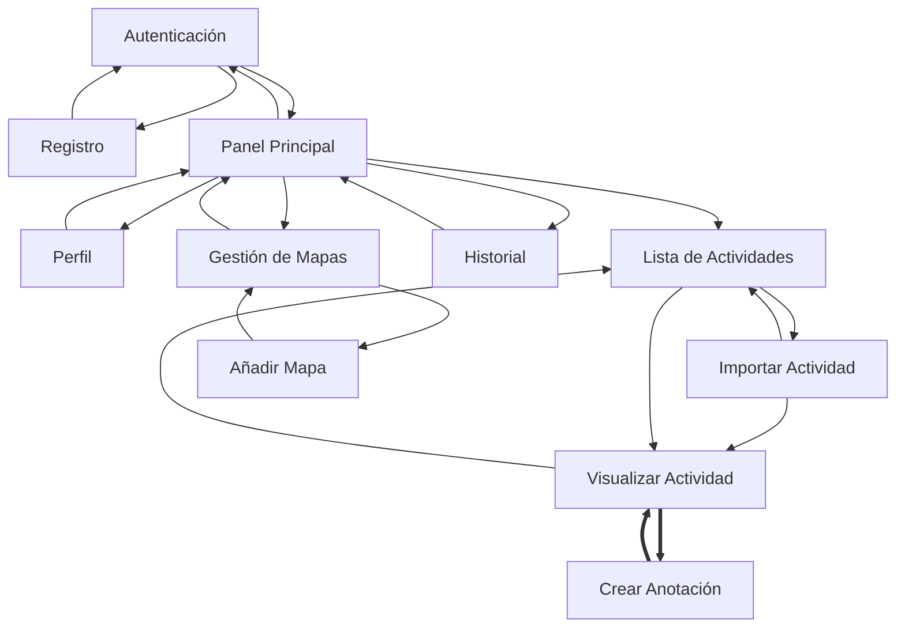
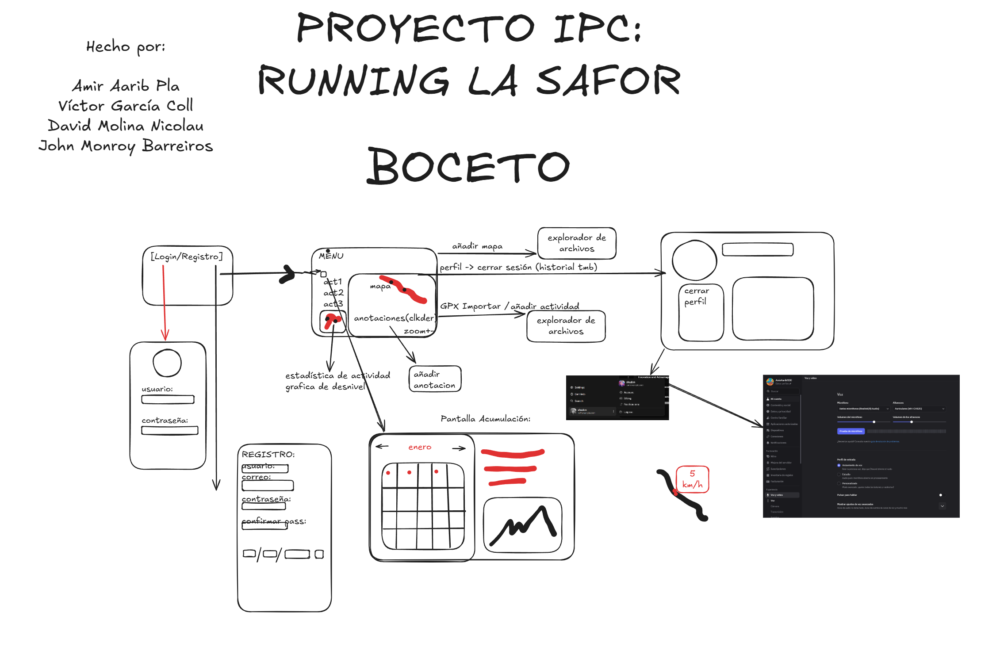
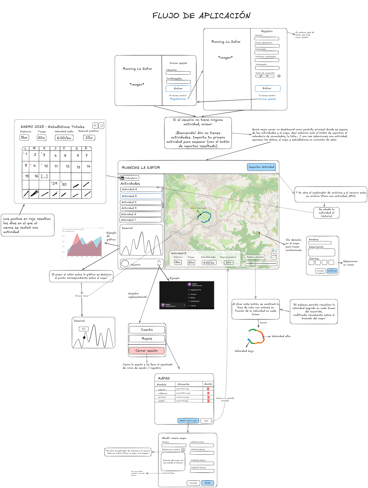
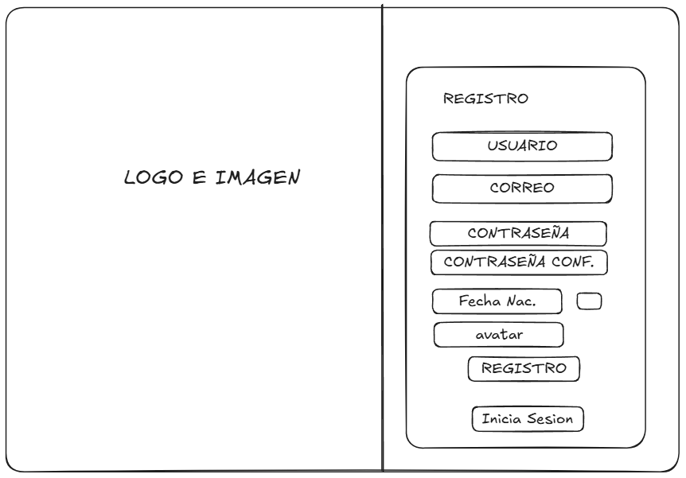
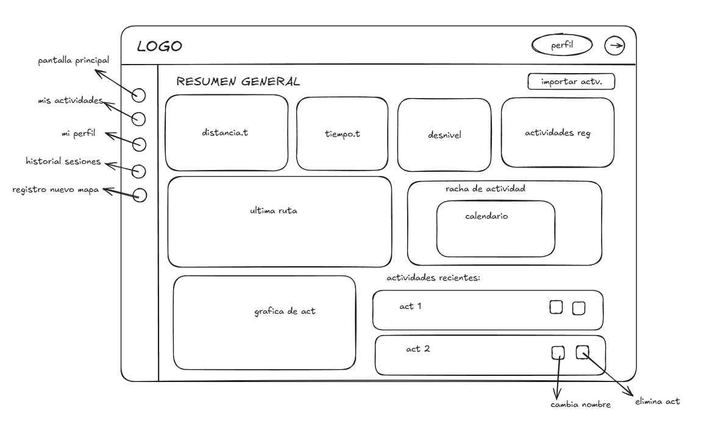
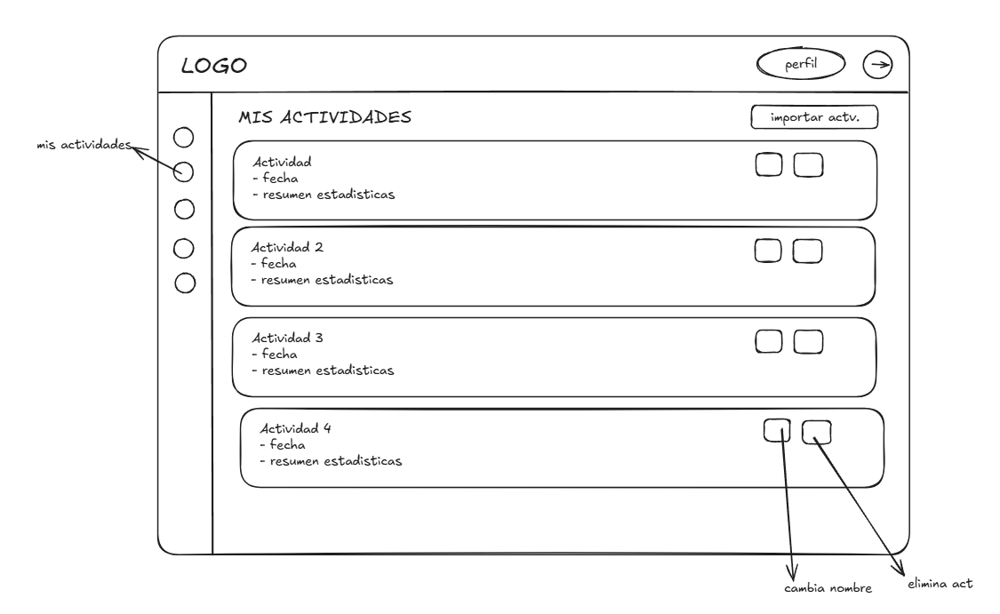

# Running la Safor - Memoria de Diseño

## Introducción
Este repositorio contiene el código y la documentación del proyecto **"Running la Safor"**, una aplicación de escritorio diseñada para que los socios del club deportivo puedan registrar, visualizar y analizar sus rutas al aire libre (ficheros GPX) sobre mapas interactivos. Este documento detalla la fase de **Diseño Conceptual y Arquitectura de Información**.

## Equipo de Desarrollo (Grupo 2B1 + 2C2)
* David Molina Nicolau (2B1)
* Víctor García Coll (2B1)
* Amir Aarib Pla (2B1)
* John Monroy Barreiros (2C2)

---

## Índice General del Proyecto

1. [Fase 1: Diseño Conceptual](#fase-1-diseño-conceptual)
   * [1.1. Perfil del Usuario](#11-perfil-del-usuario)
   * [1.2. Escenarios y Tareas](#12-escenarios-y-tareas)
   * [1.3. Extracción de Objetos y Modelo OVID](#13-extracción-de-objetos-y-modelo-ovid)
   * [1.4. Contenedores de Interacción](#14-contenedores-de-interacción)
   * [1.5. Trazabilidad de Escenarios](#15-trazabilidad-de-escenarios)
   * [1.6. Diagrama de Contenidos](#16-diagrama-de-contenidos)

2. [Fase 2: Prototipado de Baja Fidelidad](#fase-2-prototipado-de-baja-fidelidad)
   * [2.1. Metodología de Prototipado Iterativo](#21-metodología-de-prototipado-iterativo)
   * [2.2. Iteración 1: Boceto Exploratorio](#22-iteración-1-boceto-exploratorio)
   * [2.3. Iteración 2: Flujo de Aplicación](#23-iteración-2-flujo-de-aplicación)
   * [2.4. Iteración 3: Wireframes Refinados](#24-iteración-3-wireframes-refinados)
   * [2.5. Trazabilidad entre Escenarios e Interacción](#25-trazabilidad-entre-escenarios-e-interacción)
   * [2.6. Selección de Controles](#26-selección-de-controles)
   * [2.7. Evaluación y Evolución del Prototipo](#27-evaluación-y-evolución-del-prototipo)
   * [2.8. Relación con el Producto Final](#28-relación-con-el-producto-final)

3. [Fase 3: Implementación y Aplicación Final](#fase-3-implementación-y-aplicación-final)
   * [3.1. Control de Cambios y Commits](#31-control-de-cambios-y-commits)
   * [3.2. Criterio de Cierre de Implementación](#32-criterio-de-cierre-de-implementación)
   * [3.3. Demostración de la Interfaz](#33-demostración-de-la-interfaz)
   * [3.4. Validación de Escenarios](#34-validación-de-escenarios)
   * [3.5. Despliegue y Pruebas](#35-despliegue-y-pruebas)

---

# Fase 1: Diseño Conceptual

## 1.1. Perfil del Usuario
El usuario objetivo es un socio de **Running la Safor** que registra actividades al aire libre con relojes GPS, dispositivos *wearables* o aplicaciones móviles, y necesita revisar sus rutas después del entrenamiento.

| Aspecto | Definición |
| --- | --- |
| Perfil | Deportista no necesariamente técnico, acostumbrado a consultar métricas deportivas y mapas. |
| Objetivos | Importar ficheros GPX, visualizar el trazado, consultar estadísticas, analizar desnivel/velocidad y añadir anotaciones geográficas. |
| Necesidades | Acceso rápido a sus actividades, lectura clara de métricas, interacción directa con mapa y gráfica, y gestión sencilla de perfil/mapas. |
| Contexto de uso | Aplicación de escritorio usada tras entrenamientos, con énfasis en revisión, organización y análisis. |
| Riesgos de interacción | Errores al introducir credenciales, coordenadas de mapas o anotaciones; pérdida de orientación al cambiar entre vistas; sobrecarga de datos técnicos. |

[Volver al índice](#índice-general-del-proyecto)

---

## 1.2. Escenarios y Tareas
A partir de los escenarios del enunciado, se extraen las tareas que debe soportar el sistema. Esta tabla es la base del diseño conceptual: cada tarea se convertirá después en objetos, acciones, contenedores y enlaces.

| Categoría del caso | Tarea conceptual | Resultado esperado |
| --- | --- | --- |
| Usuarios | T1.1 Registrarse | Crear un usuario válido con nickname único, email, contraseña, fecha de nacimiento y avatar opcional. |
| Usuarios | T1.2 Autenticarse | Verificar credenciales y permitir el acceso al sistema. |
| Usuarios | T1.3 Modificar perfil | Actualizar email, contraseña, fecha de nacimiento o avatar manteniendo nickname no editable. |
| Usuarios | T1.4 Cerrar sesión | Finalizar la sesión y conservar sus estadísticas de uso. |
| Usuarios | T1.5 Visualizar historial | Consultar sesiones anteriores, duración y totales de uso. |
| Actividades | T2.1 Importar GPX | Crear una actividad a partir de un fichero GPX y mostrar ruta, inicio, fin y métricas. |
| Actividades | T2.2 Visualizar actividad | Revisar trazado, anotaciones y estadísticas completas de una actividad. |
| Actividades | T2.3 Añadir anotaciones | Crear marcas de tipo punto, texto, línea o círculo asociadas a coordenadas del mapa. |
| Actividades | T2.4 Consultar acumulado | Ver tiempo, distancia y desniveles acumulados. |
| Actividades | T2.5 Borrar o renombrar actividad | Mantener organizada la lista de actividades del usuario. |
| Ruta en mapa | T3.1 Realizar zoom | Cambiar la escala manteniendo trazado y anotaciones alineados. |
| Ruta en mapa | T3.2 Centrar o reencuadrar ruta | Recuperar una vista legible del recorrido completo. |
| Análisis adicional | T4.1 Consultar perfil de desnivel | Relacionar gráfica de altitud con el punto equivalente del mapa. |
| Análisis adicional | T4.2 Visualizar velocidad sobre trazado | Interpretar cambios de velocidad mediante codificación visual sobre la ruta. |
| Mapas | T5.1 Añadir mapa | Registrar una imagen de mapa con nombre y coordenadas geográficas de sus límites. |
| Mapas | T5.2 Gestionar mapas | Consultar y eliminar mapas cuando no estén asociados a actividades. |

[Volver al índice](#índice-general-del-proyecto)

---

## 1.3. Extracción de Objetos y Modelo OVID
Siguiendo el procedimiento del Tema 5, primero se analizan escenarios concretos para localizar objetos de tarea, atributos y acciones. En los textos de uso se marcan en **negrita** los objetos de tarea y en ***negrita cursiva*** los atributos en su primera aparición.

### 1.3.1. Extracción desde Escenarios Concretos

**A) Gestión de usuario**

| Acción del usuario | Respuesta del sistema |
| --- | --- |
| El **usuario** solicita registrarse e introduce su ***nickname***, ***correo electrónico***, ***contraseña***, ***fecha de nacimiento*** y, opcionalmente, la ***ruta del avatar***. | El sistema valida las reglas de los campos, inicializa la ***lista de actividades*** y la ***lista de sesiones***, e informa del resultado. |
| El usuario solicita autenticarse introduciendo nickname y contraseña. | El sistema verifica las credenciales y da acceso al resto de funciones. |
| El usuario decide cerrar sesión. | El sistema guarda los datos de la **sesión**: ***instante de inicio***, ***instante de fin***, ***duración total***, ***núm. actividades importadas***, ***núm. actividades visualizadas*** y ***núm. anotaciones creadas***. |

**B) Gestión de actividades**

| Acción del usuario | Respuesta del sistema |
| --- | --- |
| El usuario solicita registrar una **actividad** nueva seleccionando un fichero GPX. | El sistema procesa el fichero, muestra el trazado, resalta inicio/fin y calcula ***nombre***, ***distancia total***, ***duración***, ***velocidad media***, ***ritmo medio***, ***desnivel positivo***, ***desnivel negativo***, ***altitud mínima*** y ***altitud máxima***. |
| El usuario selecciona una actividad de la lista para visualizarla. | El sistema muestra la ***lista de puntos GPS***, las anotaciones existentes y las estadísticas calculadas. |
| El usuario consulta el acumulado de actividades. | El sistema calcula tiempo total, distancia acumulada y metros de ascenso/descenso. |

**C) Interacción con mapa y análisis**

| Acción del usuario | Respuesta del sistema |
| --- | --- |
| El usuario amplía o reduce la **vista de mapa** mediante zoom. | El sistema ajusta la ***escala*** y el ***encuadre*** manteniendo trazado y anotaciones alineados. |
| El usuario consulta el perfil de desnivel. | El sistema destaca el **punto GPS** correspondiente y muestra su ***latitud y longitud***, ***altitud***, ***instante de registro***, ***distancia parcial*** y ***velocidad del tramo***. |

**D) Anotaciones y mapas**

| Acción del usuario | Respuesta del sistema |
| --- | --- |
| El usuario solicita añadir una **anotación** sobre la actividad. | El sistema permite elegir ***tipo de anotación***, ***texto asociado***, ***color hex***, ***grosor del trazo*** y una ***lista de puntos geográficos***. |
| El usuario añade una **región de mapa** nueva. | El sistema registra la ***ruta de la imagen***, el ***nombre de la región*** y su ***bounding box*** con ***latitud máxima***, ***latitud mínima***, ***longitud máxima*** y ***longitud mínima***. |

### 1.3.2. Modelo Conceptual Consolidado

#### Relaciones padre/hijo
| Objeto padre | Objetos hijo o relacionados | Motivo conceptual |
| --- | --- | --- |
| Usuario | Actividad, Sesión | El usuario posee sus rutas y su historial de uso. |
| Actividad | Punto GPS, Anotación, Región de mapa | Una actividad se interpreta mediante recorrido, marcas y mapa asociado. |
| Anotación | Punto geográfico | Cada anotación se posiciona sobre una o varias coordenadas. |
| Región de mapa | Bounding box | La región necesita límites geográficos para ubicar rutas. |
| Vista de mapa | Actividad, Anotación, Punto GPS | No es objeto de datos; es el espacio donde se manipulan ruta, zoom y anotaciones. |

#### Objetos, atributos y acciones
| Objeto de tarea | Clasificación | Atributos | Acciones |
| --- | --- | --- | --- |
| **Usuario** | Principal | Nickname, correo electrónico, contraseña, fecha de nacimiento, ruta del avatar, lista de actividades, lista de sesiones | Registrarse, autenticarse, modificar perfil, cerrar sesión. |
| **Sesión** | Hijo de Usuario | Instante de inicio, instante de fin, duración total, actividades importadas, actividades visualizadas, anotaciones creadas | Visualizar historial, consultar totales. |
| **Actividad** | Principal de datos, hija de Usuario | Nombre, distancia, duración, ritmo, velocidad media, desnivel positivo/negativo, altitud mínima/máxima, puntos GPS, mapa asociado, anotaciones | Importar, listar, visualizar, renombrar, borrar, consultar acumulado. |
| **Punto GPS** | Hijo de Actividad | Latitud, longitud, altitud, instante, distancia parcial, velocidad de tramo | Resaltar en mapa, sincronizar con gráfica, mostrar detalle. |
| **Anotación** | Hijo de Actividad | Tipo, texto, color, grosor, puntos geográficos asociados | Crear, visualizar, editar color, eliminar. |
| **Punto geográfico** | Hijo de Anotación | Latitud, longitud | Posicionar anotación sobre el mapa. |
| **Región de mapa** | Soporte cartográfico | Nombre, imagen, latitud mínima/máxima, longitud mínima/máxima, bounding box | Añadir, listar, validar límites, eliminar si no está en uso. |
| **Vista de mapa** | Interacción no persistente | Escala, encuadre, ruta visible, anotaciones visibles, punto destacado | Ampliar, reducir, centrar, mostrar velocidad, sincronizar con desnivel. |

#### Decisiones de modelado
| Decisión | Justificación |
| --- | --- |
| Separar `Región de mapa` y `Vista de mapa` | Evita confundir el dato persistente del mapa con la interacción visual sobre él. |
| Considerar `Punto GPS` objeto hijo de `Actividad` | Permite explicar el perfil de desnivel, la velocidad por tramo y el resaltado sobre el mapa. |
| Mantener `Anotación` como objeto propio | Tiene tipo, texto, color, grosor y posiciones; no es solo un atributo de la actividad. |
| Tratar `Sesión` como objeto propio | El usuario consulta historial y estadísticas de uso, por tanto tiene entidad conceptual. |

[Volver al índice](#índice-general-del-proyecto)

---

## 1.4. Contenedores de Interacción
A continuación se definen los contenedores con la plantilla formal del Tema 5: objetivo, funciones, enlaces, objetos y restricciones.

| Autenticación |
| :--- |
| **Objetivo:** Permitir el acceso de usuarios registrados.  **Funciones:** ⚫ Introducir nickname y contraseña. ⚫ Solicitar registro. ◼ Validar credenciales.  **Enlaces:** ▶ Panel Principal ▶ Registro  **Objetos:** Usuario  **Restricciones:** No se accede al resto de módulos sin autenticación correcta. |

| Registro |
| :--- |
| **Objetivo:** Crear una nueva cuenta de usuario.  **Funciones:** ⚫ Introducir nickname, email, contraseña, fecha de nacimiento y avatar opcional. ◼ Validar campos. ◼ Informar del resultado.  **Enlaces:** ▶ Autenticación  **Objetos:** Usuario  **Restricciones:** Nickname único de 6 a 15 caracteres, contraseña segura, email válido y edad mayor de 12 años. |

| Panel Principal |
| :--- |
| **Objetivo:** Servir como centro de navegación de la sesión activa.  **Funciones:** ◼ Mostrar accesos principales. ⚫ Ir a actividades, historial, perfil o mapas. ⚫ Cerrar sesión.  **Enlaces:** ▶ Lista de Actividades ▶ Historial ▶ Perfil ▶ Gestión de Mapas ▶ Autenticación  **Objetos:** Usuario, Actividad resumida, Sesión resumida  **Restricciones:** Requiere una sesión iniciada. |

| Perfil |
| :--- |
| **Objetivo:** Consultar y modificar los datos personales del usuario.  **Funciones:** ◼ Mostrar datos actuales. ⚫ Modificar email, contraseña, fecha o avatar. ◼ Validar y guardar cambios.  **Enlaces:** ▶ Panel Principal  **Objetos:** Usuario  **Restricciones:** El nickname no es editable. |

| Lista de Actividades |
| :--- |
| **Objetivo:** Listar y mantener las actividades importadas.  **Funciones:** ◼ Mostrar actividades con métricas básicas. ⚫ Seleccionar actividad. ⚫ Importar, renombrar o borrar actividad.  **Enlaces:** ▶ Panel Principal ▶ Importar Actividad ▶ Visualizar Actividad  **Objetos:** Usuario, Actividad  **Restricciones:** Renombrar o borrar exige una actividad seleccionada. |

| Importar Actividad |
| :--- |
| **Objetivo:** Crear una actividad a partir de un fichero GPX.  **Funciones:** ⚫ Seleccionar GPX. ◼ Procesar puntos GPS y estadísticas. ◼ Asociar mapa compatible.  **Enlaces:** ▶ Lista de Actividades ▶ Visualizar Actividad  **Objetos:** Actividad, Punto GPS, Región de mapa  **Restricciones:** El fichero debe contener una ruta válida y representable sobre un mapa disponible. |

| Visualizar Actividad |
| :--- |
| **Objetivo:** Analizar una actividad sobre mapa, métricas y gráfica.  **Funciones:** ◼ Mostrar ruta, inicio, fin, anotaciones y estadísticas. ⚫ Usar zoom y centrado. ⚫ Consultar perfil de desnivel y velocidad. ⚫ Añadir anotación.  **Enlaces:** ▶ Lista de Actividades ▶▶ Crear Anotación  **Objetos:** Actividad, Punto GPS, Anotación, Vista de mapa, Región de mapa  **Restricciones:** Mapa, ruta, anotaciones y gráfica deben permanecer sincronizados. |

| Crear Anotación |
| :--- |
| **Objetivo:** Añadir una anotación geográfica a la actividad activa.  **Funciones:** ⚫ Elegir posición, tipo, texto, color y grosor. ◼ Asociar coordenadas. ◼ Guardar o cancelar.  **Enlaces:** ▶▶ Visualizar Actividad  **Objetos:** Anotación, Punto geográfico, Actividad  **Restricciones:** POINT/TEXT requieren una coordenada; LINE/CIRCLE requieren dos. |

| Historial |
| :--- |
| **Objetivo:** Consultar sesiones de uso y acumulados.  **Funciones:** ◼ Mostrar sesiones con duración y estadísticas. ◼ Calcular totales. ⚫ Consultar historial.  **Enlaces:** ▶ Panel Principal  **Objetos:** Sesión, Actividad  **Restricciones:** Las sesiones son informativas y no editables. |

| Gestión de Mapas |
| :--- |
| **Objetivo:** Administrar las regiones de mapa disponibles.  **Funciones:** ◼ Listar mapas. ⚫ Añadir mapa. ⚫ Eliminar mapa no usado.  **Enlaces:** ▶ Panel Principal ▶ Añadir Mapa  **Objetos:** Región de mapa  **Restricciones:** No se elimina una región usada por actividades. |

| Añadir Mapa |
| :--- |
| **Objetivo:** Registrar una nueva región de mapa.  **Funciones:** ⚫ Introducir nombre, imagen y coordenadas límite. ◼ Validar límites. ◼ Registrar región o mostrar errores.  **Enlaces:** ▶ Gestión de Mapas  **Objetos:** Región de mapa, Bounding box  **Restricciones:** Las coordenadas deben representar correctamente los límites geográficos de la imagen. |

[Volver al índice](#índice-general-del-proyecto)

---

## 1.5. Trazabilidad de Escenarios
Esta tabla verifica que todos los escenarios del caso práctico están soportados por al menos una tarea, un objeto conceptual y un contenedor.

| Escenario del caso | Tarea | Objetos | Contenedores |
| --- | --- | --- | --- |
| Registrarse | T1.1 | Usuario | Registro, Autenticación |
| Autenticarse | T1.2 | Usuario | Autenticación, Panel Principal |
| Modificar perfil | T1.3 | Usuario | Perfil |
| Cerrar sesión | T1.4 | Usuario, Sesión | Panel Principal, Autenticación |
| Visualizar historial | T1.5 | Sesión, Actividad | Historial |
| Registrar actividad nueva | T2.1 | Actividad, Punto GPS, Región de mapa | Lista de Actividades, Importar Actividad, Visualizar Actividad |
| Añadir anotaciones | T2.3 | Anotación, Punto geográfico, Actividad | Visualizar Actividad, Crear Anotación |
| Visualizar actividad | T2.2 | Actividad, Punto GPS, Anotación, Vista de mapa | Lista de Actividades, Visualizar Actividad |
| Acumulado de actividades | T2.4 | Actividad | Historial, Panel Principal |
| Borrar/renombrar actividad | T2.5 | Actividad | Lista de Actividades |
| Realizar zoom | T3.1 | Vista de mapa, Actividad, Anotación | Visualizar Actividad |
| Perfil de desnivel | T4.1 | Punto GPS, Actividad | Visualizar Actividad |
| Velocidad sobre trazado | T4.2 | Punto GPS, Actividad, Vista de mapa | Visualizar Actividad |
| Añadir mapa al sistema | T5.1 | Región de mapa, Bounding box | Gestión de Mapas, Añadir Mapa |
| Gestionar mapas | T5.2 | Región de mapa | Gestión de Mapas |

[Volver al índice](#índice-general-del-proyecto)

---

## 1.6. Diagrama de Contenidos
Los enlaces simples indican que el nuevo contenedor sustituye al actual. Los enlaces dobles indican que ambos contenedores trabajan en paralelo, como el editor de anotaciones abierto sobre la visualización de una actividad.

[Volver al índice](#índice-general-del-proyecto)

---

# Fase 2: Prototipado de Baja Fidelidad

## 2.1. Metodología de Prototipado Iterativo

Siguiendo las directrices del Tema 7, la interfaz se diseñó mediante un proceso iterativo de prototipado de baja fidelidad. El objetivo fue validar la arquitectura de información, la distribución de contenidos y el flujo de navegación antes de consolidar la implementación final en JavaFX.

Se utilizaron bocetos y wireframes estructurales porque permiten trabajar rápido, cambiar decisiones con bajo coste y centrar la discusión en las tareas del usuario. Además, al evitar detalles propios de alta fidelidad como paletas de color, tipografías o acabados visuales, se facilita que las críticas se dirijan a la estructura, la navegación y la interacción.

[Volver al índice](#índice-general-del-proyecto)

## 2.2. Iteración 1: Boceto Exploratorio

La primera aproximación fue un boceto inicial de baja fidelidad, usado para ubicar de forma rápida los elementos principales del sistema: acceso, registro, actividades, mapa, métricas, perfil, historial, mapas y anotaciones.

Este boceto permitió detectar qué información debía aparecer en cada zona y qué pantallas necesitaban separarse para evitar una interfaz demasiado densa.

[Volver al índice](#índice-general-del-proyecto)

## 2.3. Iteración 2: Flujo de Aplicación

Después del boceto inicial se elaboró un diagrama de flujo con enfoque de storyboard, centrado en la secuencia de tareas que realiza el socio dentro de la aplicación.

El flujo representa tareas críticas del caso práctico: registrarse o autenticarse, importar un fichero GPX, visualizar una actividad, consultar el perfil de desnivel, mostrar la velocidad sobre el trazado, crear anotaciones y gestionar mapas.

[Volver al índice](#índice-general-del-proyecto)

## 2.4. Iteración 3: Wireframes Refinados

A partir del flujo anterior se definieron los wireframes estructurales definitivos. En esta iteración se priorizó la jerarquía del contenido y la organización de cada contenedor, manteniendo una representación sencilla propia de baja fidelidad.

### Acceso y Cuenta

Las pantallas de autenticación, registro y perfil agrupan los campos de entrada necesarios para crear, validar y actualizar la cuenta del usuario. El nickname se trata como identificador principal y no editable tras el registro.

### Actividades y Resumen

La pantalla principal ofrece una vista resumida de la actividad del usuario, mientras que la lista de actividades separa la gestión operativa: importar, seleccionar, renombrar o borrar rutas.

### Análisis Cartográfico

La vista de actividad concentra el análisis de la ruta: mapa, métricas, acciones sobre la actividad, control de velocidad y gráfica de desnivel. Esta agrupación mantiene juntos los elementos que deben consultarse de forma sincronizada.

### Historial y Mapas

El historial se plantea como una vista informativa de sesiones anteriores. La gestión de mapas queda separada como tarea administrativa, con entrada explícita de imagen y coordenadas del bounding box.

[Volver al índice](#índice-general-del-proyecto)

## 2.5. Trazabilidad entre Escenarios e Interacción

| Escenario del caso | Pantalla principal | Interacción prevista |
| --- | --- | --- |
| Registrarse | Registro | Introducir nickname, email, contraseña, fecha y avatar opcional. |
| Autenticarse | Login | Introducir credenciales y acceder al sistema. |
| Modificar perfil | Perfil | Actualizar datos editables manteniendo el nickname bloqueado. |
| Cerrar sesión | Pantalla principal / cabecera | Finalizar la sesión activa y volver al acceso. |
| Visualizar historial | Historial de sesiones | Consultar sesiones, duración y acciones realizadas. |
| Registrar actividad nueva | Mis Actividades | Importar un fichero GPX desde el sistema de archivos. |
| Visualizar actividad | Vista Actividad | Revisar mapa, trazado, métricas y anotaciones. |
| Añadir anotaciones | Vista Actividad | Crear marcas asociadas a coordenadas del mapa. |
| Realizar zoom | Vista Actividad | Ampliar o reducir el mapa manteniendo ruta y anotaciones alineadas. |
| Perfil de desnivel | Vista Actividad | Relacionar la gráfica inferior con el punto equivalente del recorrido. |
| Velocidad sobre trazado | Vista Actividad | Activar u ocultar la codificación visual de velocidad. |
| Añadir mapa al sistema | Añadir Mapa | Seleccionar imagen e introducir coordenadas exactas del bounding box. |

[Volver al índice](#índice-general-del-proyecto)

## 2.6. Selección de Controles

Los controles se escogieron por su adecuación a la tarea y por su capacidad para reducir errores de interacción:

* **Campos de texto y contraseña:** usados en login, registro, perfil y coordenadas de mapas, donde el usuario debe introducir datos específicos.
* **Selector de archivo:** usado para GPX, avatar e imagen de mapa, aprovechando un patrón familiar del sistema operativo.
* **Botones de acción:** usados para comandos directos como iniciar sesión, registrarse, importar, guardar, cancelar o añadir mapa.
* **Acciones contextuales sobre actividades:** usadas para renombrar o borrar sin obligar al usuario a navegar a otra pantalla.
* **Controles de zoom y encuadre:** usados en el mapa para permitir manipulación directa de la visualización.
* **Panel o diálogo contextual de anotación:** previsto para crear marcas sobre el mapa sin perder el contexto geográfico de la actividad.

[Volver al índice](#índice-general-del-proyecto)

## 2.7. Evaluación y Evolución del Prototipo

El prototipo se usó para responder preguntas de diseño antes de cerrar la estructura de pantallas:

El flujo y los wireframes fueron revisados internamente por el equipo antes de cerrar la estructura final, comprobando que las tareas principales del caso quedaban cubiertas.

| Pregunta de diseño | Decisión tomada |
| --- | --- |
| ¿Debe la pantalla principal mezclar resumen, lista completa y análisis detallado? | No. Se separó el resumen general de la lista de actividades y de la vista de detalle para reducir densidad visual. |
| ¿Es eficiente el flujo tras importar un GPX? | Se planteó que la actividad importada pueda abrirse directamente en la vista de análisis, evitando pasos intermedios innecesarios. |
| ¿Mapa y gráfica deben estar en pantallas separadas? | No. Se mantuvieron juntos para que el usuario relacione altitud, posición y recorrido sin cambiar de contexto. |
| ¿La gestión de mapas debe mezclarse con la visualización de rutas? | No. Se aisló como tarea administrativa para no cargar la vista de actividad con controles poco frecuentes. |

[Volver al índice](#índice-general-del-proyecto)

## 2.8. Relación con el Producto Final

Los prototipos de baja fidelidad no tienen que coincidir de forma exacta con el producto final. Su función es servir como herramienta de exploración y evaluación temprana; por tanto, pueden cambiar detalles de distribución, nombres o controles durante la implementación.

Lo importante es que se mantenga la coherencia con los escenarios del caso: las tareas principales, los objetos de interacción y los flujos de navegación definidos en el prototipo deben seguir siendo reconocibles en la aplicación final.

[Volver al índice](#índice-general-del-proyecto)

---

# Fase 3: Implementación y Aplicación Final

## 3.1. Control de Cambios y Commits
De acuerdo con los criterios de evaluación de la asignatura, el desarrollo y la documentación del proyecto se han realizado de forma incremental. El historial de GitHub permite comprobar la evolución del trabajo y la participación del equipo:

👉 **[Consultar el Historial de Commits del Proyecto](https://github.com/Proyecto-IPC/proyecto-IPC/commits/master/)**

[Volver al índice](#índice-general-del-proyecto)

---

## 3.2. Criterio de Cierre de Implementación
La implementación final se considera cerrada cuando los escenarios definidos en el caso práctico pueden completarse desde la interfaz gráfica sin acceder manualmente a la base de datos ni modificar las clases de la librería proporcionada.

El objetivo de esta fase no es solo que la aplicación compile, sino demostrar que el diseño conceptual y el prototipado se han convertido en una interfaz usable, coherente y verificable.

[Volver al índice](#índice-general-del-proyecto)

---

## 3.3. Demostración de la Interfaz
Para la defensa del proyecto se recomienda preparar **un único vídeo general**, no un vídeo por cada tarea. Un vídeo único mantiene la narrativa completa de uso y evita repeticiones; basta con que recorra las tareas principales de forma ordenada.

Guion recomendado para el vídeo:

1. **Acceso y cuenta:** iniciar sesión, mostrar registro brevemente y abrir el perfil.
2. **Resumen principal:** enseñar la pantalla inicial, totales y navegación lateral.
3. **Actividades:** importar un GPX, abrir la actividad creada, renombrarla y mostrar la opción de borrado.
4. **Análisis de ruta:** enseñar mapa, zoom, métricas, perfil de desnivel y visualización de velocidad.
5. **Anotaciones:** crear una anotación sobre el mapa y comprobar que aparece asociada a la actividad.
6. **Historial y cierre:** abrir historial de sesiones, cerrar sesión y volver al acceso.
7. **Mapas:** mostrar gestión de mapas y el formulario de alta con imagen y bounding box.

Duración óptima: **5-7 minutos**. Si se quiere añadir material complementario, es mejor usar clips muy cortos solo para interacciones difíciles de apreciar en directo, como zoom, anotaciones o sincronización mapa-gráfica.

EJEMPLO VIDEO:

<video src="assets/videoDemoEjemplo.mp4" width="100%" controls>
  Tu navegador no soporta la reproducción de vídeos nativos de HTML5.
</video>

_👉 Si el reproductor no carga correctamente en tu navegador, puedes [descargar el vídeo de demostración directamente desde aquí](assets/videoDemoEjemplo.mp4)._

[Volver al índice](#índice-general-del-proyecto)

---

## 3.4. Validación de Escenarios
La siguiente matriz resume qué debe comprobarse en la aplicación final para cubrir el caso práctico:

| Categoría | Escenario validado | Evidencia esperada en la interfaz |
| --- | --- | --- |
| Usuarios | Registro, login, perfil y cierre de sesión | Formularios funcionales, validaciones visibles y retorno al acceso tras cerrar sesión. |
| Sesiones | Historial de sesiones | Lista de sesiones con duración y contadores de uso. |
| Actividades | Importar, listar, renombrar y borrar GPX | Lista actualizada y actividad abierta con métricas calculadas. |
| Mapa | Visualizar ruta y hacer zoom | Ruta dibujada sobre imagen cartográfica, con inicio/fin y escalado correcto. |
| Anotaciones | Crear marcas geográficas | Anotación persistente asociada a coordenadas de la actividad. |
| Análisis | Perfil de desnivel y velocidad | Gráfica de altitud y codificación visual de velocidad sobre el trazado. |
| Mapas | Añadir y gestionar mapas | Alta de imagen con coordenadas exactas del bounding box y listado de mapas. |

[Volver al índice](#índice-general-del-proyecto)

---

## 3.5. Despliegue y Pruebas
Para probar la aplicación en el entorno de evaluación:

1. Clonar o descargar este repositorio en su entorno local.
2. Abrir el proyecto desde NetBeans.
3. Comprobar que las librerías de `/lib` están añadidas al proyecto.
4. Ejecutar la clase principal de la aplicación.
5. Probar el flujo completo con los recursos incluidos en `/gpx` y `/maps`.

El repositorio incluye las librerías necesarias en `/lib`, los mapas base en `/maps` y ficheros GPX de prueba en `/gpx`, por lo que la revisión puede realizarse sin preparar datos externos.

[Volver al índice](#índice-general-del-proyecto)

---

## Uso de inteligencia artificial

Durante el desarrollo se ha utilizado IA como apoyo para generar código, proponer mejoras, detectar posibles errores y refinar decisiones de diseño. Las decisiones finales, la validación funcional y la adaptación al caso de uso del proyecto han sido realizadas por el equipo.

La IA también se ha utilizado para apoyar el formato y la claridad del README, incluyendo la estructura en Markdown y algunos diagramas/esquemas en Mermaid.

[Volver al índice](#índice-general-del-proyecto)
