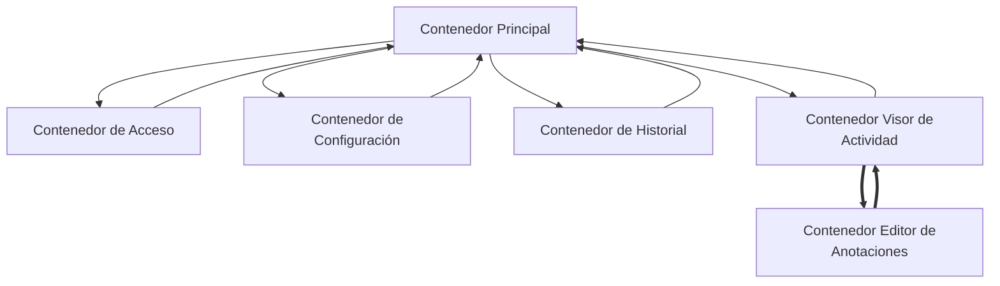

# Running la Safor - Memoria de Diseño

## Introducción
Este repositorio contiene el código y la documentación del proyecto **"Running la Safor"**, una aplicación de escritorio diseñada para que los socios del club deportivo puedan registrar, visualizar y analizar sus rutas al aire libre (ficheros GPX) sobre mapas interactivos. Este documento detalla la fase de **Diseño Conceptual y Arquitectura de Información**.

## Equipo de Desarrollo (Grupo 2B1 + 2C2)
* David Molina Nicolau (2B1)
* Víctor García Coll (2B1)
* Amir Aarib Pla (2B1)
* John Monroy Barreiros (2C2)

---

## Índice General del Proyecto

1. [Fase 1: Diseño Conceptual](#fase-1-diseño-conceptual)
   * [1.1. Perfil del Usuario](#11-perfil-del-usuario)
   * [1.2. Especificación de Requisitos](#12-especificación-de-requisitos)
   * [1.3. Casos de Uso y Modelado de Datos](#13-casos-de-uso-y-modelado-de-datos)
     * [1.3.1. Categoría 1: Usuarios](#131-categoría-1-usuarios)
     * [1.3.2. Categoría 2: Actividades](#132-categoría-2-actividades)
     * [1.3.3. Categoría 3: Ruta en Mapa](#133-categoría-3-ruta-en-mapa)
     * [1.3.4. Categoría 4: Análisis de Datos](#134-categoría-4-análisis-de-datos)
     * [1.3.5. Categoría 5: Mapas](#135-categoría-5-mapas)
   * [1.4. Contenedores de Interacción](#14-contenedores-de-interacción)
   * [1.5. Arquitectura de Navegación](#15-arquitectura-de-navegación)
     * [1.5.1. Diagrama de Navegación Detallado](#151-diagrama-de-navegación-detallado)
     * [1.5.2. Diagrama de Contenidos Simplificado](#152-diagrama-de-contenidos-simplificado)

2. [Fase 2: Prototipado de Baja Fidelidad](#fase-2-prototipado-de-baja-fidelidad)
   * [2.1. Diseños de Pantallas y Wireframes](#21-diseños-de-pantallas-y-wireframes)
   * [2.2. Selección de Controles e Interacción](#22-selección-de-controles-e-interacción)
   * [2.3. Justificación de Composición Visual](#23-justificación-de-composición-visual)

3. [Fase 3: Implementación y Aplicación Final](#fase-3-implementación-y-aplicación-final)
   * [3.1. Control de Cambios y Commits](#31-control-de-cambios-y-commits)
   * [3.2. Demostración de la Interfaz](#32-demostración-de-la-interfaz)
   * [3.3. Despliegue y Pruebas](#33-despliegue-y-pruebas)

---

# Fase 1: Diseño Conceptual

## 1.1. Perfil del Usuario
Basándonos en el análisis de necesidades del sistema, hemos definido el perfil del usuario objetivo para la aplicación:

* **Rol y Contexto:** Es un socio del club "Running la Safor" que realiza actividades al aire libre. Acostumbra a registrar sus rutas utilizando relojes con GPS, dispositivos *wearables* o aplicaciones de *tracking* en el teléfono móvil.
* **Objetivos Principales:** Necesita una plataforma para subir sus ficheros GPX, visualizar el trazado sobre un mapa y añadir anotaciones geográficas relevantes (como zonas peligrosas).
* **Necesidades de Información:** Requiere consultar de forma clara estadísticas técnicas como la distancia, duración, velocidad (incluyendo velocidad sobre el trazado) y el perfil de desnivel de sus rutas.

[⬆️ Volver al índice](#índice-general-del-proyecto)

---

## 1.2. Especificación de Requisitos
A partir de los escenarios de uso proporcionados en el documento base, hemos abstraído y clasificado las tareas fundamentales que el sistema debe soportar. Estas tareas conforman la base para nuestro posterior Diseño Conceptual:

* **Categoría 1 - Gestión de Usuarios**
  * **T1.1:** Registrarse en la aplicación (con validación de credenciales, edad y avatar).
  * **T1.2:** Autenticarse en el sistema mediante nickname y contraseña.
  * **T1.3:** Modificar el perfil de usuario (avatar y contraseña).
  * **T1.4:** Cerrar sesión, guardando automáticamente las estadísticas de uso.
  * **T1.5:** Visualizar el historial de sesiones pasadas y sus estadísticas acumuladas.

* **Categoría 2 - Gestión de Actividades**
  * **T2.1:** Registrar una actividad nueva importando un fichero GPX.
  * **T2.2:** Visualizar en detalle una actividad (trazado, estadísticas y anotaciones).
  * **T2.3:** Consultar el acumulado total de actividades del mes (distancia, tiempo, desniveles).

* **Categoría 3 - Interacción con la Ruta y el Mapa**
  * **T3.1:** Realizar zoom (acercar/alejar) escalando correctamente el trazado y las anotaciones.
  * **T3.2:** Añadir anotaciones gráficas personalizadas (punto, texto, línea, círculo) sobre la actividad.

* **Categoría 4 - Análisis Adicional de Datos**
  * **T4.1:** Visualizar e interactuar con la gráfica del perfil de desnivel.
  * **T4.2:** Visualizar la velocidad seguida codificada visualmente sobre el trazado del mapa.

* **Categoría 5 - Gestión de Mapas**
  * **T5.1:** Añadir un nuevo mapa al sistema introduciendo la imagen JPG y las coordenadas de su *bounding box*.

[⬆️ Volver al índice](#índice-general-del-proyecto)

---

## 1.3. Casos de Uso y Modelado de Datos
En este bloque se define la arquitectura de información y la lógica de interacción del sistema siguiendo la metodología OVID.

A partir del análisis de los casos de uso y apoyándonos en el modelo de datos proporcionado por la librería del proyecto, extraemos los objetos, sus atributos internos y las acciones que se pueden realizar sobre ellos.

En los casos de uso, se resaltan en **negrita** los sustantivos (que formarán los Objetos de tarea) y en ***negrita cursiva*** los atributos de dichos objetos, marcándolos únicamente en su primera aparición. Los verbos (acciones) y elementos de la interfaz física no reciben marcado, cumpliendo estrictamente con la especificación teórica.

### 1.3.1. Categoría 1: Usuarios

| Acción del usuario | Respuesta del sistema |
| --- | --- |
| El **usuario** solicita registrarse e introduce su ***nickname***, ***correo electrónico***, ***contraseña***, ***fecha de nacimiento*** y opcionalmente la ***ruta del avatar***. | El sistema valida las reglas de los campos, inicializa la ***lista de actividades*** y la ***lista de sesiones***, e informa del resultado del registro. |
| El usuario solicita autenticarse introduciendo su nickname y contraseña. | El sistema verifica las credenciales y da acceso al resto de funciones. |
| El usuario accede a modificar perfil, visualizando su información actual y guardando un nuevo avatar o contraseña. | El sistema aplica las reglas de validación y actualiza los datos del usuario. |
| El usuario solicita visualizar su historial para analizar cada **sesión** de uso de la aplicación. | El sistema muestra las sesiones registradas con su ***duración total*** y estadísticas (***núm. actividades importadas***, ***núm. actividades visualizadas*** y ***núm. anotaciones creadas***). |
| El usuario decide cerrar sesión. | El sistema guarda automáticamente los datos de la sesión (***instante de inicio*** e ***instante de fin***) en la base de datos. |

### Modelo Conceptual: Objetos de Tarea (Categoría 1)

**Tabla 1.1: Objeto Usuario**
| Objeto de tarea | Atributos | Acciones |
| --- | --- | --- |
| **Usuario** | Nickname | Registrarse |
| | Correo electrónico | Autenticarse |
| | Contraseña | Modificar perfil |
| | Fecha de nacimiento | |
| | Ruta del avatar | |
| | Lista de actividades | |
| | Lista de sesiones | |

**Tabla 1.2: Objeto Sesión**
| Objeto de tarea | Atributos | Acciones |
| --- | --- | --- |
| **Sesión** | Instante de inicio | Cerrar sesión |
| | Instante de fin | Visualizar historial |
| | Duración total | |
| | Núm. actividades importadas | |
| | Núm. actividades visualizadas | |
| | Núm. anotaciones creadas | |

[⬆️ Volver al índice](#índice-general-del-proyecto)

---

### 1.3.2. Categoría 2: Actividades

| Acción del usuario | Respuesta del sistema |
| --- | --- |
| El usuario solicita registrar una **actividad** nueva seleccionando un archivo. | El sistema procesa la información, extrae el ***nombre***, la ***distancia total***, la ***duración***, la ***velocidad media***, el ***ritmo medio*** y asigna un ***mapa sugerido***. |
| El usuario selecciona una actividad de la lista para visualizarla en detalle. | El sistema muestra la ***lista de puntos GPS*** en la vista principal, incluyendo la altimetría (***desnivel positivo***, ***desnivel negativo***, ***altitud mínima*** y ***altitud máxima***). |
| El usuario solicita añadir una **anotación**, hace clic en la vista, elige el ***tipo de anotación***, escribe el ***texto asociado***, selecciona el ***color hex*** y ajusta el ***grosor del trazo***. | El sistema asocia la ***lista de puntos geográficos*** correspondientes y guarda la anotación de forma persistente. |
| El usuario solicita consultar el acumulado de actividades del mes. | El sistema calcula y muestra los totales basándose en los datos de las actividades registradas. |
| El usuario selecciona una actividad y solicita borrarla o renombrarla. | El sistema elimina o actualiza la actividad y todos sus datos vinculados. |

### Modelo Conceptual: Objetos de Tarea (Categoría 2)

**Tabla 2.1: Objeto Actividad**
| Objeto de tarea | Atributos | Acciones |
| --- | --- | --- |
| **Actividad** | Nombre | Registrar / Importar |
| | Lista de puntos GPS | Visualizar |
| | Distancia total | Borrar / Eliminar |
| | Duración | Consultar acumulado |
| | Velocidad media | Renombrar |
| | Ritmo medio | |
| | Desnivel positivo | |
| | Desnivel negativo | |
| | Altitud mínima | |
| | Altitud máxima | |
| | Mapa sugerido | |

**Tabla 2.2: Objeto Anotación**
| Objeto de tarea | Atributos | Acciones |
| --- | --- | --- |
| **Anotación** | Tipo de anotación | Añadir / Crear |
| | Texto asociado | Eliminar |
| | Color hex | Modificar color |
| | Grosor del trazo | |
| | Lista de puntos geográficos | |

[⬆️ Volver al índice](#índice-general-del-proyecto)

---

### 1.3.3. Categoría 3: Ruta en Mapa

| Acción del usuario | Respuesta del sistema |
| --- | --- |
| El usuario solicita realizar zoom (acercar o alejar) interactuando con el **mapa**. | El sistema escala y reposiciona la representación visual de la ruta. |
| El usuario solicita centrar la vista. | El sistema evalúa los límites geográficos y centra el visor. |

### Modelo Conceptual: Objetos de Tarea (Categoría 3)

**Tabla 3.1: Objeto Mapa**
| Objeto de tarea | Atributos | Acciones |
| --- | --- | --- |
| **Mapa** | | Realizar zoom |
| | | Centrar visor |

[⬆️ Volver al índice](#índice-general-del-proyecto)

---

### 1.3.4. Categoría 4: Otras - Análisis de Datos

| Acción del usuario | Respuesta del sistema |
| --- | --- |
| El usuario solicita visualizar el perfil de desnivel interactuando con la vista analítica. | El sistema resalta de forma sincronizada el **punto GPS** correspondiente, revelando su ***altitud***, su ***instante de registro*** y su ***distancia parcial***. |
| El usuario solicita visualizar la velocidad sobre el trazado. | El sistema calcula la ***velocidad del tramo*** para cada punto y aplica una codificación visual basada en sus coordenadas de ***latitud y longitud***. |

### Modelo Conceptual: Objetos de Tarea (Categoría 4)

**Tabla 4.1: Objeto Punto GPS**
| Objeto de tarea | Atributos | Acciones |
| --- | --- | --- |
| **Punto GPS** | Latitud y longitud | Resaltar en mapa |
| | Altitud | Mostrar detalle / Tooltip |
| | Instante de registro | Visualizar velocidad sobre trazado |
| | Velocidad del tramo | Visualizar perfil de desnivel |
| | Distancia parcial | |

[⬆️ Volver al índice](#índice-general-del-proyecto)

---

### 1.3.5. Categoría 5: Mapas

| Acción del usuario | Respuesta del sistema |
| --- | --- |
| El usuario solicita añadir un **mapa** nuevo al sistema seleccionando una ***ruta de la imagen***. | El sistema carga el fichero y lo previsualiza. |
| El usuario introduce un ***nombre de la región*** y especifica las coordenadas de los bordes (***latitud máxima***, ***latitud mínima***, ***longitud máxima*** y ***longitud mínima***). | El sistema valida que las coordenadas sean correctas y registra el nuevo mapa de forma persistente. |

### Modelo Conceptual: Objetos de Tarea (Categoría 5)

**Tabla 5.1: Objeto Mapa (Ampliación de Registro)**
| Objeto de tarea | Atributos | Acciones |
| --- | --- | --- |
| **Mapa** | Ruta de la imagen | Añadir / Registrar mapa |
| | Nombre de la región | Validar coordenadas |
| | Latitud máxima | |
| | Latitud mínima | |
| | Longitud máxima | |
| | Longitud mínima | |

[⬆️ Volver al índice](#índice-general-del-proyecto)

---

## 1.4. Contenedores de Interacción
A continuación se definen los contenedores lógicos que soportan la funcionalidad del sistema:

| Principal |
| :--- |
| **Objetivo:** Seleccionar la tarea a realizar y actuar como punto central de navegación del sistema.<br><br>**Funciones:**<br>◼ Mostrar opciones de navegación disponibles<br>⚫ Seleccionar opción de registro o acceso al sistema<br>⚫ Seleccionar opción de gestión de actividades<br>⚫ Seleccionar opción de historial o acumulado<br>⚫ Seleccionar opción de configuración (perfil o mapas)<br><br>**Enlaces:**<br>▶ Contenedor de Acceso<br>▶ Contenedor Visor de Actividad<br>▶ Contenedor de Historial<br>▶ Contenedor de Configuración<br><br>**Objetos:**<br>(Ninguno - Actúa únicamente como enrutador del sistema)<br><br>**Restricciones:**<br>El usuario debe estar previamente autenticado en el sistema para poder visualizar y acceder a los enlaces de actividades, historial y configuración. |

| Acceso |
| :--- |
| **Objetivo:** Gestionar el registro de nuevos miembros y la autenticación de usuarios existentes en el sistema.<br><br>**Funciones:**<br>⚫ Solicitar registrarse e introducir nickname, correo electrónico, contraseña, fecha de nacimiento y ruta del avatar<br>◼ Validar reglas de los campos, inicializar lista de actividades y lista de sesiones, e informar del resultado del registro<br>⚫ Solicitar autenticarse introduciendo nickname y contraseña<br>◼ Verificar credenciales y dar acceso<br><br>**Enlaces:**<br>▶ Contenedor Principal (tras verificación exitosa)<br><br>**Objetos:**<br>Usuario<br><br>**Restricciones:**<br>El nickname debe tener entre 6 y 15 caracteres y ser único. La contraseña debe tener entre 8 y 20 caracteres e incluir mayúscula, minúscula, dígito y símbolo. La edad mínima permitida es de 12 años. |

| Configuración |
| :--- |
| **Objetivo:** Gestionar los ajustes del sistema, permitiendo modificar el perfil del usuario y registrar nuevos mapas.<br><br>**Funciones:**<br>⚫ Acceder a modificar perfil, visualizando información actual y guardando un nuevo avatar o contraseña<br>◼ Aplicar reglas de validación y actualizar los datos del usuario<br>⚫ Solicitar añadir un mapa nuevo al sistema seleccionando una ruta de la imagen<br>◼ Cargar el fichero y previsualizarlo<br>⚫ Introducir nombre de la región y especificar coordenadas de los bordes (latitud máxima, mínima y longitud máxima, mínima)<br>◼ Validar que las coordenadas sean correctas y registrar el nuevo mapa de forma persistente<br><br>**Enlaces:**<br>▶ Contenedor Principal (para volver al menú)<br><br>**Objetos:**<br>Usuario, Mapa<br><br>**Restricciones:**<br>Los valores del bounding box del mapa deben coincidir exactamente con los que imprime el script de Python; no se pueden usar valores aproximados para evitar errores de proyección. |

| Historial |
| :--- |
| **Objetivo:** Visualizar el registro de uso de la aplicación y consultar las estadísticas acumuladas de las carreras.<br><br>**Funciones:**<br>⚫ Solicitar visualizar su historial para analizar cada sesión de uso de la aplicación<br>◼ Mostrar las sesiones registradas con su duración total y estadísticas (núm. actividades importadas, visualizadas y anotaciones creadas)<br>⚫ Solicitar consultar el acumulado de actividades del mes<br>◼ Calcular y mostrar los totales basándose en los datos de las actividades registradas<br><br>**Enlaces:**<br>▶ Contenedor Principal (para volver al menú)<br><br>**Objetos:**<br>Sesión, Actividad<br><br>**Restricciones:**<br>Los datos de las sesiones se generan automáticamente al cerrar sesión y no son editables por el usuario. |

| Visor de Actividad |
| :--- |
| **Objetivo:** Importar, representar visualmente y analizar en detalle los datos técnicos, geográficos y biométricos de una carrera.<br><br>**Funciones:**<br>⚫ Solicitar registrar una actividad nueva seleccionando un archivo<br>◼ Procesar la información, extraer el nombre, la distancia total, la duración, la velocidad media, el ritmo medio y asignar un mapa sugerido<br>⚫ Seleccionar una actividad de la lista para visualizarla en detalle<br>◼ Mostrar la lista de puntos GPS en la vista principal, incluyendo la altimetría (desnivel positivo, negativo, altitud mínima y máxima)<br>⚫ Seleccionar una actividad y solicitar borrarla o renombrarla<br>◼ Eliminar o actualizar la actividad y todos sus datos vinculados<br>⚫ Solicitar realizar zoom (acercar o alejar) interactuando con el mapa<br>◼ Escalar y reposicionar la representación visual de la ruta<br>⚫ Solicitar centrar la vista<br>◼ Evaluar los límites geográficos y centrar el visor<br>⚫ Solicitar visualizar el perfil de desnivel interactuando con la vista analítica<br>◼ Resaltar de forma sincronizada el punto GPS correspondiente, revelando su altitud, su instante de registro y su distancia parcial<br>⚫ Solicitar visualizar la velocidad sobre el trazado<br>◼ Calcular la velocidad del tramo para cada punto y aplicar una codificación visual basada en sus coordenadas de latitud y longitud<br><br>**Enlaces:**<br>▶ Contenedor Principal (para volver al menú)<br>▶▶ Contenedor Editor de Anotaciones (trabaja en paralelo sobre el mapa)<br><br>**Objetos:**<br>Actividad, Mapa, Punto GPS<br><br>**Restricciones:**<br>La transformación de coordenadas geográficas a la pantalla debe realizarse utilizando `MapProjection` para garantizar que el trazado coincida con la imagen estática. |

| Editor de Anotaciones |
| :--- |
| **Objetivo:** Permitir al usuario crear y personalizar marcas gráficas sobre el trazado del mapa sin abandonar la vista principal.<br><br>**Funciones:**<br>⚫ Solicitar añadir una anotación, hacer clic en la vista, elegir el tipo de anotación, escribir el texto asociado, seleccionar el color hex y ajustar el grosor del trazo<br>◼ Asociar la lista de puntos geográficos correspondientes y guardar la anotación de forma persistente<br><br>**Enlaces:**<br>▶▶ Contenedor Visor de Actividad (actúa como cuadro de diálogo emergente, no sustituye a la vista base)<br><br>**Objetos:**<br>Anotación<br><br>**Restricciones:**<br>Dependiendo del tipo de anotación seleccionado, el sistema debe capturar un número exacto de coordenadas: 1 para POINT/TEXT, y 2 para LINE/CIRCLE. |

[⬆️ Volver al índice](#índice-general-del-proyecto)

---

## 1.5. Arquitectura de Navegación

### 1.5.1. Diagrama de Navegación Detallado
Representación detallada del flujo de interacción y estados:

```mermaid
flowchart TD

    %% Nodos principales (Contenedores)
    C0["<div style='text-align: left; max-width: 300px; white-space: normal; word-break: break-word; padding: 0px;'><h3>PRINCIPAL</h3><b>Objetivo:</b> Seleccionar la tarea a realizar y actuar como punto central de navegación del sistema.<br><br><b>Funciones:</b><br>◼ Mostrar opciones de navegación disponibles<br>⚫ Seleccionar opción de registro o acceso al sistema<br>⚫ Seleccionar opción de gestión de actividades<br>⚫ Seleccionar opción de historial o acumulado<br>⚫ Seleccionar opción de configuración (perfil o mapas)<br><br><b>Enlaces:</b><br>▶ Contenedor de Acceso<br>▶ Contenedor Visor de Actividad<br>▶ Contenedor de Historial<br>▶ Contenedor de Configuración<br><br><b>Objetos:</b><br>(Ninguno - Actúa únicamente como enrutador del sistema)<br><br><b>Restricciones:</b><br>El usuario debe estar previamente autenticado en el sistema para poder visualizar y acceder a los enlaces de actividades, historial y configuración.</div>"]

    C1["<div style='text-align: left; max-width: 300px; white-space: normal; word-break: break-word; padding: 0px;'><h3>ACCESO</h3><b>Objetivo:</b> Gestionar el registro de nuevos miembros y la autenticación de usuarios existentes en el sistema.<br><br><b>Funciones:</b><br>⚫ Solicitar registrarse e introducir nickname, correo electrónico, contraseña, fecha de nacimiento y ruta del avatar<br>◼ Validar reglas de los campos, inicializar lista de actividades y lista de sesiones, e informar del resultado del registro<br>⚫ Solicitar autenticarse introduciendo nickname y contraseña<br>◼ Verificar credenciales y dar acceso<br><br><b>Enlaces:</b><br>▶ Contenedor Principal (tras verificación exitosa)<br><br><b>Objetos:</b><br>Usuario<br><br><b>Restricciones:</b><br>El nickname debe tener entre 6 y 15 caracteres y ser único. La contraseña debe tener entre 8 y 20 caracteres e incluir mayúscula, minúscula, dígito y símbolo. La edad mínima permitida es de 12 años.</div>"]

    C2["<div style='text-align: left; max-width: 300px; white-space: normal; word-break: break-word; padding: 0px;'><h3>CONFIGURACIÓN</h3><b>Objetivo:</b> Gestionar los ajustes del sistema, permitiendo modificar el perfil del usuario y registrar nuevos mapas.<br><br><b>Funciones:</b><br>⚫ Acceder a modificar perfil, visualizando información actual y guardando un nuevo avatar o contraseña<br>◼ Aplicar reglas de validación y actualizar los datos del usuario<br>⚫ Solicitar añadir un mapa nuevo al sistema seleccionando una ruta de la imagen<br>◼ Cargar el fichero y previsualizarlo<br>⚫ Introducir nombre de la región y especificar coordenadas de los bordes (latitud máxima, mínima y longitud máxima, mínima)<br>◼ Validar que las coordenadas sean correctas y registrar el nuevo mapa de forma persistente<br><br><b>Enlaces:</b><br>▶ Contenedor Principal (para volver al menú)<br><br><b>Objetos:</b><br>Usuario, Mapa<br><br><b>Restricciones:</b><br>Los valores del bounding box del mapa deben coincidir exactamente con los que imprime el script de Python; no se pueden usar valores aproximados para evitar errores de proyección.</div>"]

    C3["<div style='text-align: left; max-width: 300px; white-space: normal; word-break: break-word; padding: 0px;'><h3>HISTORIAL</h3><b>Objetivo:</b> Visualizar el registro de uso de la aplicación y consultar las estadísticas acumuladas de las carreras.<br><br><b>Funciones:</b><br>⚫ Solicitar visualizar su historial para analizar cada sesión de uso de la aplicación<br>◼ Mostrar las sesiones registradas con su duración total y estadísticas (núm. actividades importadas, visualizadas y anotaciones creadas)<br>⚫ Solicitar consultar el acumulado de actividades del mes<br>◼ Calcular y mostrar los totales basándose en los datos de las actividades registradas<br><br><b>Enlaces:</b><br>▶ Contenedor Principal (para volver al menú)<br><br><b>Objetos:</b><br>Sesión, Actividad<br><br><b>Restricciones:</b><br>Los datos de las sesiones se generan automáticamente al cerrar sesión y no son editables por el usuario.</div>"]

    C4["<div style='text-align: left; max-width: 300px; white-space: normal; word-break: break-word; padding: 0px;'><h3>VISOR DE ACTIVIDAD</h3><b>Objetivo:</b> Importar, representar visualmente y analizar en detalle los datos técnicos, geográficos y biométricos de una carrera.<br><br><b>Funciones:</b><br>⚫ Solicitar registrar una actividad nueva seleccionando un archivo<br>◼ Procesar la información, extraer el nombre, la distancia total, la duración, la velocidad media, el ritmo medio y asignar un mapa sugerido<br>⚫ Seleccionar una actividad de la lista para visualizarla en detalle<br>◼ Mostrar la lista de puntos GPS en la vista principal, incluyendo la altimetría (desnivel positivo, negativo, altitud mínima y máxima)<br>⚫ Seleccionar una actividad y solicitar borrarla o renombrarla<br>◼ Eliminar o actualizar la actividad y todos sus datos vinculados<br>⚫ Solicitar realizar zoom (acercar o alejar) interactuando con el mapa<br>◼ Escalar y reposicionar la representación visual de la ruta<br>⚫ Solicitar centrar la vista<br>◼ Evaluar los límites geográficos y centrar el visor<br>⚫ Solicitar visualizar el perfil de desnivel interactuando con la vista analítica<br>◼ Resaltar de forma sincronizada el punto GPS correspondiente, revelando su altitud, su instante de registro y su distancia parcial<br>⚫ Solicitar visualizar la velocidad sobre el trazado<br>◼ Calcular la velocidad del tramo para cada punto y aplicar una codificación visual basada en sus coordenadas de latitud y longitud<br><br><b>Enlaces:</b><br>▶ Contenedor Principal (para volver al menú)<br>▶▶ Contenedor Editor de Anotaciones (trabaja en paralelo sobre el mapa)<br><br><b>Objetos:</b><br>Actividad, Mapa, Punto GPS<br><br><b>Restricciones:</b><br>La transformación de coordenadas geográficas a la pantalla debe realizarse utilizando `MapProjection` para garantizar que el trazado coincida con la imagen estática.</div>"]

    C5["<div style='text-align: left; max-width: 300px; white-space: normal; word-break: break-word; padding: 0px;'><h3>EDITOR DE ANOTACIONES</h3><b>Objetivo:</b> Permitir al usuario crear y personalizar marcas gráficas sobre el trazado del mapa sin abandonar la vista principal.<br><br><b>Funciones:</b><br>⚫ Solicitar añadir una anotación, hacer clic en la vista, elegir el tipo de anotación, escribir el texto asociado, seleccionar el color hex y ajustar el grosor del trazo<br>◼ Asociar la lista de puntos geográficos correspondientes y guardar la anotación de forma persistente<br><br><b>Enlaces:</b><br>▶▶ Contenedor Visor de Actividad (actúa como cuadro de diálogo emergente, no sustituye a la vista base)<br><br><b>Objetos:</b><br>Anotación<br><br><b>Restricciones:</b><br>Dependiendo del tipo de anotación seleccionado, el sistema debe capturar un número exacto de coordenadas: 1 para POINT/TEXT, y 2 para LINE/CIRCLE.</div>"]

    %% Conexiones con Condiciones de Interacción (Diapositiva 39)
    C0 -->|No Autenticado| C1
    C1 -->|Autenticación exitosa| C0

    C0 -->|Autenticado| C4
    C4 -->|Volver al menú| C0

    C4 ==>|Abre diálogo flotante| C5
    C5 ==>|Cierra diálogo| C4

    C0 -->|Autenticado| C3
    C3 -->|Volver al menú| C0

    C0 -->|Autenticado| C2
    C2 -->|Volver al menú| C0
```



[⬆️ Volver al índice](#índice-general-del-proyecto)

---

### 1.5.2. Diagrama de Contenidos Simplificado
Vista global de la estructura de navegación:



[⬆️ Volver al índice](#índice-general-del-proyecto)

---

# Fase 2: Prototipado de Baja Fidelidad
`⚠️ En desarrollo`

## 2.1. Diseños de Pantallas y Wireframes

Wireframe:
# Pantalla de Login 

| Panel Izquierdo (Marca) | Panel Derecho (Formulario) |
| :--- | :--- |
| **Fondo:** Fotografía (Runners al atardecer) | **Fondo:** Color sólido (#1e1e1e) |
| **Contenido:** Logo vectorizado en blanco | **Contenido:** Formulario de acceso |

# Pantalla de Registro 

| Panel Izquierdo (Marca) | Panel Derecho (Formulario) |
| :--- | :--- |
| **Fondo:** Fotografía (Runners al atardecer) | **Fondo:** Color sólido (#1e1e1e) |
| **Contenido:** Logo vectorizado en blanco | **Contenido:** Formulario de registro con campos extendidos |

## Layout Estructural

```text
+-----------------------------------+-----------------------------------+
|                                   |                                   |
|                                   |          Iniciar sesión           |
|                                   |   Accede para consultar tus...    |
|                                   |                                   |
|             [ LOGO ]              |   Usuario                         |
|                                   |   [___________________________]   |
|         Running La Safor          |                                   |
|              -CLUB-               |   Contraseña                      |
|                                   |   [___________________________]   |
|                                   |                                   |
|                                   |   [          Entrar           ]   |
|            ( IMAGEN )             |                                   |
|                                   |   ¿No tienes cuenta?              |
|                                   |   [        Registrarme        ]   |
|                                   |                                   |
+-----------------------------------+-----------------------------------+

+-----------------------------------+-----------------------------------+
|                                   |                                   |
|                                   |             Registro              |
|                                   |   Crea tu cuenta con los...       |
|                                   |                                   |
|             [ LOGO ]              |   Usuario                         |
|                                   |   [___________________________]   |
|         Running La Safor          |                                   |
|              -CLUB-               |   Correo electrónico              |
|                                   |   [___________________________]   |
|                                   |                                   |
|                                   |   Contraseña (i)                  |
|                                   |   [___________________________]   |
|                                   |                                   |
|                                   |   Confirmar contraseña            |
|                                   |   [___________________________]   |
|                                   |                                   |
|            ( IMAGEN )             |   Fecha de nacimiento             |
|                                   |   [Día] [Mes] [Año] [Icono]       |
|                                   |                                   |
|                                   |   Avatar (opcional)               |
|                                   |   [Selecciona image] [Examinar]   |
|                                   |                                   |
|                                   |  [         Crear cuenta        ]  |
|                                   |                                   |
|                                   |   ¿Ya tienes cuenta?              |
|                                   |  [        Iniciar sesión       ]  |
|                                   |                                   |
+-----------------------------------+-----------------------------------+
```

[⬆️ Volver al índice](#índice-general-del-proyecto)

---

## 2.2. Selección de Controles e Interacción

fff

[⬆️ Volver al índice](#índice-general-del-proyecto)

---

## 2.3. Justificación de Composición Visual

fff

[⬆️ Volver al índice](#índice-general-del-proyecto)

---

# Fase 3: Implementación y Aplicación Final

## 3.1. Control de Cambios y Commits
De acuerdo con los criterios de evaluación de la asignatura, el desarrollo y la documentación de este proyecto se realizan de manera estrictamente incremental. Se puede consultar el registro detallado de las aportaciones y el trabajo en equipo de cada integrante del grupo directamente en el siguiente enlace:

👉 **[Consultar el Historial de Commits del Proyecto](https://github.com/Proyecto-IPC/proyecto-IPC/commits/master/)**

[⬆️ Volver al índice](#índice-general-del-proyecto)

---

## 3.2. Demostración de la Interfaz
*En esta sección se incluirán breves capturas de pantalla o un GIF animado del sistema interactivo real en funcionamiento para comprobar visualmente el comportamiento de la interfaz (manejo del lienzo, zoom y gráficas sincronizadas).*

[⬆️ Volver al índice](#índice-general-del-proyecto)

---

## 3.3. Despliegue y Pruebas
La aplicación se encuentra completamente desarrollada y subida al repositorio. Para probarla en el entorno de evaluación:

1. Clonar o descargar este repositorio en su entorno local.
2. Abrir el proyecto desde el IDE (ej. NetBeans).
3. **Nota:** El repositorio ya incluye la carpeta `/maps` con los recursos cartográficos originales y las librerías necesarias en la carpeta `/lib`, por lo que el proyecto está listo para compilarse y ejecutarse directamente sin configuración adicional.

[⬆️ Volver al índice](#índice-general-del-proyecto)
