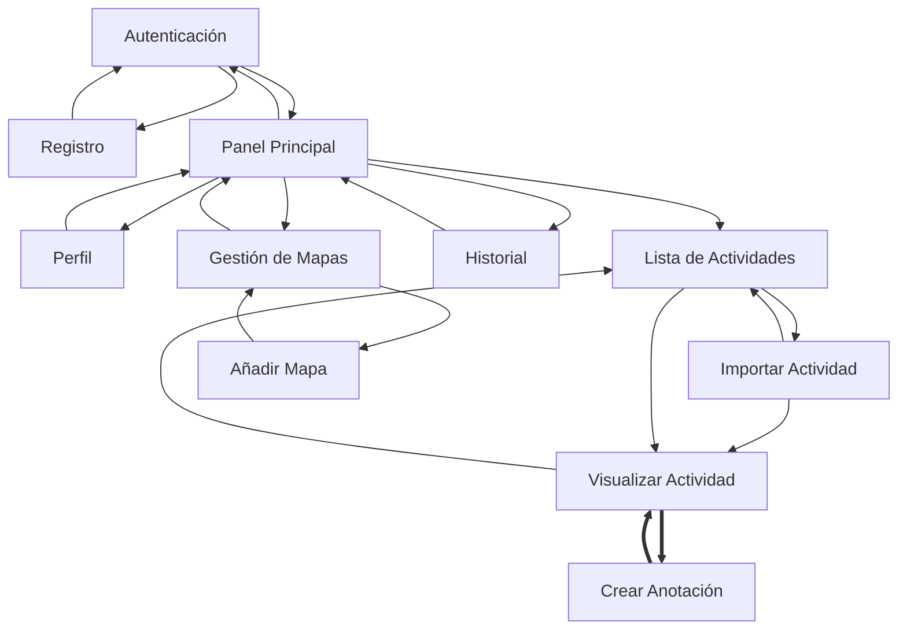
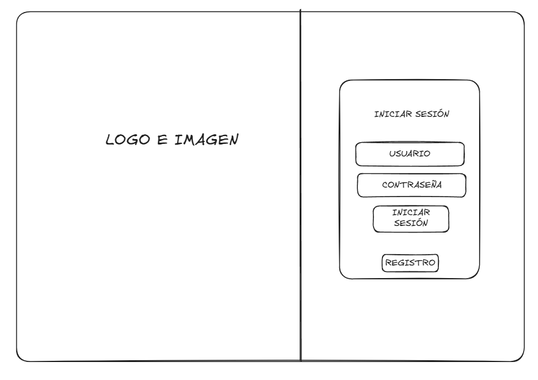
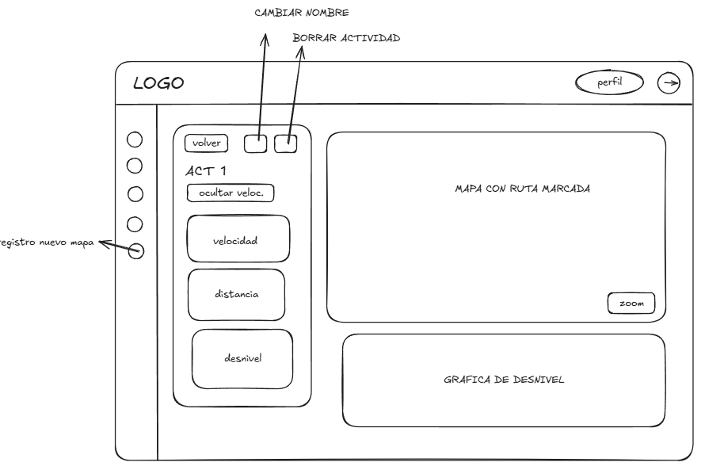
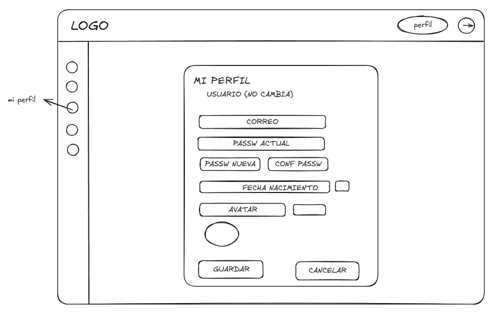
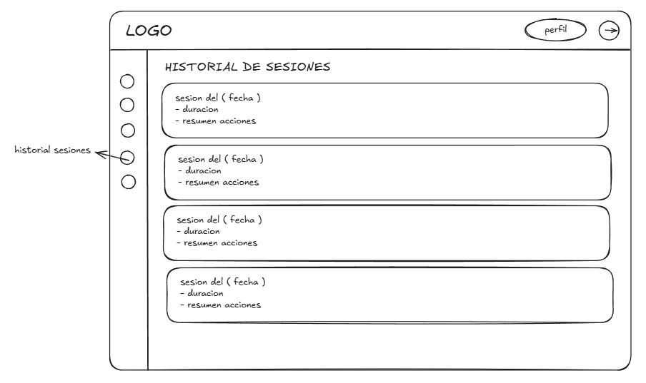
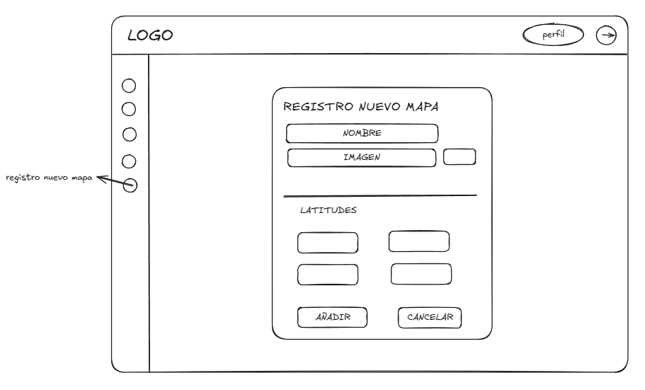

# Running la Safor - Memoria de Diseño

## Introducción
Este repositorio contiene el código y la documentación del proyecto **"Running la Safor"**, una aplicación de escritorio diseñada para que los socios del club deportivo puedan registrar, visualizar y analizar sus rutas al aire libre (ficheros GPX) sobre mapas interactivos. Este documento detalla la fase de **Diseño Conceptual y Arquitectura de Información**.

## Equipo de Desarrollo (Grupo 2B1 + 2C2)
* David Molina Nicolau (2B1)
* Víctor García Coll (2B1)
* Amir Aarib Pla (2B1)
* John Monroy Barreiros (2C2)

---

## Índice General del Proyecto

1. [Fase 1: Diseño Conceptual](#fase-1-diseño-conceptual)
   * [1.1. Perfil del Usuario](#11-perfil-del-usuario)
   * [1.2. Escenarios y Tareas](#12-escenarios-y-tareas)
   * [1.3. Extracción de Objetos y Modelo OVID](#13-extracción-de-objetos-y-modelo-ovid)
   * [1.4. Contenedores de Interacción](#14-contenedores-de-interacción)
   * [1.5. Trazabilidad de Escenarios](#15-trazabilidad-de-escenarios)
   * [1.6. Diagrama de Contenidos](#16-diagrama-de-contenidos)

2. [Fase 2: Prototipado de Baja Fidelidad](#fase-2-prototipado-de-baja-fidelidad)
   * [2.1. Diseños de Pantallas y Wireframes](#21-diseños-de-pantallas-y-wireframes)
   * [2.2. Selección de Controles e Interacción](#22-selección-de-controles-e-interacción)
   * [2.3. Justificación de Composición Visual](#23-justificación-de-composición-visual)

3. [Fase 3: Implementación y Aplicación Final](#fase-3-implementación-y-aplicación-final)
   * [3.1. Control de Cambios y Commits](#31-control-de-cambios-y-commits)
   * [3.2. Demostración de la Interfaz](#32-demostración-de-la-interfaz)
   * [3.3. Despliegue y Pruebas](#33-despliegue-y-pruebas)

---

# Fase 1: Diseño Conceptual

## 1.1. Perfil del Usuario
El usuario objetivo es un socio de **Running la Safor** que registra actividades al aire libre con relojes GPS, dispositivos *wearables* o aplicaciones móviles, y necesita revisar sus rutas después del entrenamiento.

| Aspecto | Definición |
| --- | --- |
| Perfil | Deportista no necesariamente técnico, acostumbrado a consultar métricas deportivas y mapas. |
| Objetivos | Importar ficheros GPX, visualizar el trazado, consultar estadísticas, analizar desnivel/velocidad y añadir anotaciones geográficas. |
| Necesidades | Acceso rápido a sus actividades, lectura clara de métricas, interacción directa con mapa y gráfica, y gestión sencilla de perfil/mapas. |
| Contexto de uso | Aplicación de escritorio usada tras entrenamientos, con énfasis en revisión, organización y análisis. |
| Riesgos de interacción | Errores al introducir credenciales, coordenadas de mapas o anotaciones; pérdida de orientación al cambiar entre vistas; sobrecarga de datos técnicos. |

[⬆️ Volver al índice](#índice-general-del-proyecto)

---

## 1.2. Escenarios y Tareas
A partir de los escenarios del enunciado, se extraen las tareas que debe soportar el sistema. Esta tabla es la base del diseño conceptual: cada tarea se convertirá después en objetos, acciones, contenedores y enlaces.

| Categoría del caso | Tarea conceptual | Resultado esperado |
| --- | --- | --- |
| Usuarios | T1.1 Registrarse | Crear un usuario válido con nickname único, email, contraseña, fecha de nacimiento y avatar opcional. |
| Usuarios | T1.2 Autenticarse | Verificar credenciales y permitir el acceso al sistema. |
| Usuarios | T1.3 Modificar perfil | Actualizar email, contraseña, fecha de nacimiento o avatar manteniendo nickname no editable. |
| Usuarios | T1.4 Cerrar sesión | Finalizar la sesión y conservar sus estadísticas de uso. |
| Usuarios | T1.5 Visualizar historial | Consultar sesiones anteriores, duración y totales de uso. |
| Actividades | T2.1 Importar GPX | Crear una actividad a partir de un fichero GPX y mostrar ruta, inicio, fin y métricas. |
| Actividades | T2.2 Visualizar actividad | Revisar trazado, anotaciones y estadísticas completas de una actividad. |
| Actividades | T2.3 Añadir anotaciones | Crear marcas de tipo punto, texto, línea o círculo asociadas a coordenadas del mapa. |
| Actividades | T2.4 Consultar acumulado | Ver tiempo, distancia y desniveles acumulados. |
| Actividades | T2.5 Borrar o renombrar actividad | Mantener organizada la lista de actividades del usuario. |
| Ruta en mapa | T3.1 Realizar zoom | Cambiar la escala manteniendo trazado y anotaciones alineados. |
| Ruta en mapa | T3.2 Centrar o reencuadrar ruta | Recuperar una vista legible del recorrido completo. |
| Análisis adicional | T4.1 Consultar perfil de desnivel | Relacionar gráfica de altitud con el punto equivalente del mapa. |
| Análisis adicional | T4.2 Visualizar velocidad sobre trazado | Interpretar cambios de velocidad mediante codificación visual sobre la ruta. |
| Mapas | T5.1 Añadir mapa | Registrar una imagen de mapa con nombre y coordenadas geográficas de sus límites. |
| Mapas | T5.2 Gestionar mapas | Consultar y eliminar mapas cuando no estén asociados a actividades. |

[⬆️ Volver al índice](#índice-general-del-proyecto)

---

## 1.3. Extracción de Objetos y Modelo OVID
Siguiendo el procedimiento del Tema 5, primero se analizan escenarios concretos para localizar objetos de tarea, atributos y acciones. En los textos de uso se marcan en **negrita** los objetos de tarea y en ***negrita cursiva*** los atributos en su primera aparición.

### 1.3.1. Extracción desde Escenarios Concretos

**A) Gestión de usuario**

| Acción del usuario | Respuesta del sistema |
| --- | --- |
| El **usuario** solicita registrarse e introduce su ***nickname***, ***correo electrónico***, ***contraseña***, ***fecha de nacimiento*** y, opcionalmente, la ***ruta del avatar***. | El sistema valida las reglas de los campos, inicializa la ***lista de actividades*** y la ***lista de sesiones***, e informa del resultado. |
| El usuario solicita autenticarse introduciendo nickname y contraseña. | El sistema verifica las credenciales y da acceso al resto de funciones. |
| El usuario decide cerrar sesión. | El sistema guarda los datos de la **sesión**: ***instante de inicio***, ***instante de fin***, ***duración total***, ***núm. actividades importadas***, ***núm. actividades visualizadas*** y ***núm. anotaciones creadas***. |

**B) Gestión de actividades**

| Acción del usuario | Respuesta del sistema |
| --- | --- |
| El usuario solicita registrar una **actividad** nueva seleccionando un fichero GPX. | El sistema procesa el fichero, muestra el trazado, resalta inicio/fin y calcula ***nombre***, ***distancia total***, ***duración***, ***velocidad media***, ***ritmo medio***, ***desnivel positivo***, ***desnivel negativo***, ***altitud mínima*** y ***altitud máxima***. |
| El usuario selecciona una actividad de la lista para visualizarla. | El sistema muestra la ***lista de puntos GPS***, las anotaciones existentes y las estadísticas calculadas. |
| El usuario consulta el acumulado de actividades. | El sistema calcula tiempo total, distancia acumulada y metros de ascenso/descenso. |

**C) Interacción con mapa y análisis**

| Acción del usuario | Respuesta del sistema |
| --- | --- |
| El usuario amplía o reduce la **vista de mapa** mediante zoom. | El sistema ajusta la ***escala*** y el ***encuadre*** manteniendo trazado y anotaciones alineados. |
| El usuario consulta el perfil de desnivel. | El sistema destaca el **punto GPS** correspondiente y muestra su ***latitud y longitud***, ***altitud***, ***instante de registro***, ***distancia parcial*** y ***velocidad del tramo***. |

**D) Anotaciones y mapas**

| Acción del usuario | Respuesta del sistema |
| --- | --- |
| El usuario solicita añadir una **anotación** sobre la actividad. | El sistema permite elegir ***tipo de anotación***, ***texto asociado***, ***color hex***, ***grosor del trazo*** y una ***lista de puntos geográficos***. |
| El usuario añade una **región de mapa** nueva. | El sistema registra la ***ruta de la imagen***, el ***nombre de la región*** y su ***bounding box*** con ***latitud máxima***, ***latitud mínima***, ***longitud máxima*** y ***longitud mínima***. |

### 1.3.2. Modelo Conceptual Consolidado

#### Relaciones padre/hijo
| Objeto padre | Objetos hijo o relacionados | Motivo conceptual |
| --- | --- | --- |
| Usuario | Actividad, Sesión | El usuario posee sus rutas y su historial de uso. |
| Actividad | Punto GPS, Anotación, Región de mapa | Una actividad se interpreta mediante recorrido, marcas y mapa asociado. |
| Anotación | Punto geográfico | Cada anotación se posiciona sobre una o varias coordenadas. |
| Región de mapa | Bounding box | La región necesita límites geográficos para ubicar rutas. |
| Vista de mapa | Actividad, Anotación, Punto GPS | No es objeto de datos; es el espacio donde se manipulan ruta, zoom y anotaciones. |

#### Objetos, atributos y acciones
| Objeto de tarea | Clasificación | Atributos | Acciones |
| --- | --- | --- | --- |
| **Usuario** | Principal | Nickname, correo electrónico, contraseña, fecha de nacimiento, ruta del avatar, lista de actividades, lista de sesiones | Registrarse, autenticarse, modificar perfil, cerrar sesión. |
| **Sesión** | Hijo de Usuario | Instante de inicio, instante de fin, duración total, actividades importadas, actividades visualizadas, anotaciones creadas | Visualizar historial, consultar totales. |
| **Actividad** | Principal de datos, hija de Usuario | Nombre, distancia, duración, ritmo, velocidad media, desnivel positivo/negativo, altitud mínima/máxima, puntos GPS, mapa asociado, anotaciones | Importar, listar, visualizar, renombrar, borrar, consultar acumulado. |
| **Punto GPS** | Hijo de Actividad | Latitud, longitud, altitud, instante, distancia parcial, velocidad de tramo | Resaltar en mapa, sincronizar con gráfica, mostrar detalle. |
| **Anotación** | Hijo de Actividad | Tipo, texto, color, grosor, puntos geográficos asociados | Crear, visualizar, editar color, eliminar. |
| **Punto geográfico** | Hijo de Anotación | Latitud, longitud | Posicionar anotación sobre el mapa. |
| **Región de mapa** | Soporte cartográfico | Nombre, imagen, latitud mínima/máxima, longitud mínima/máxima, bounding box | Añadir, listar, validar límites, eliminar si no está en uso. |
| **Vista de mapa** | Interacción no persistente | Escala, encuadre, ruta visible, anotaciones visibles, punto destacado | Ampliar, reducir, centrar, mostrar velocidad, sincronizar con desnivel. |

#### Decisiones de modelado
| Decisión | Justificación |
| --- | --- |
| Separar `Región de mapa` y `Vista de mapa` | Evita confundir el dato persistente del mapa con la interacción visual sobre él. |
| Considerar `Punto GPS` objeto hijo de `Actividad` | Permite explicar el perfil de desnivel, la velocidad por tramo y el resaltado sobre el mapa. |
| Mantener `Anotación` como objeto propio | Tiene tipo, texto, color, grosor y posiciones; no es solo un atributo de la actividad. |
| Tratar `Sesión` como objeto propio | El usuario consulta historial y estadísticas de uso, por tanto tiene entidad conceptual. |

[⬆️ Volver al índice](#índice-general-del-proyecto)

---

## 1.4. Contenedores de Interacción
A continuación se definen los contenedores con la plantilla formal del Tema 5: objetivo, funciones, enlaces, objetos y restricciones.

| Autenticación |
| :--- |
| **Objetivo:** Permitir el acceso de usuarios registrados.  **Funciones:** ⚫ Introducir nickname y contraseña. ⚫ Solicitar registro. ◼ Validar credenciales.  **Enlaces:** ▶ Panel Principal ▶ Registro  **Objetos:** Usuario  **Restricciones:** No se accede al resto de módulos sin autenticación correcta. |

| Registro |
| :--- |
| **Objetivo:** Crear una nueva cuenta de usuario.  **Funciones:** ⚫ Introducir nickname, email, contraseña, fecha de nacimiento y avatar opcional. ◼ Validar campos. ◼ Informar del resultado.  **Enlaces:** ▶ Autenticación  **Objetos:** Usuario  **Restricciones:** Nickname único de 6 a 15 caracteres, contraseña segura, email válido y edad mayor de 12 años. |

| Panel Principal |
| :--- |
| **Objetivo:** Servir como centro de navegación de la sesión activa.  **Funciones:** ◼ Mostrar accesos principales. ⚫ Ir a actividades, historial, perfil o mapas. ⚫ Cerrar sesión.  **Enlaces:** ▶ Lista de Actividades ▶ Historial ▶ Perfil ▶ Gestión de Mapas ▶ Autenticación  **Objetos:** Usuario, Actividad resumida, Sesión resumida  **Restricciones:** Requiere una sesión iniciada. |

| Perfil |
| :--- |
| **Objetivo:** Consultar y modificar los datos personales del usuario.  **Funciones:** ◼ Mostrar datos actuales. ⚫ Modificar email, contraseña, fecha o avatar. ◼ Validar y guardar cambios.  **Enlaces:** ▶ Panel Principal  **Objetos:** Usuario  **Restricciones:** El nickname no es editable. |

| Lista de Actividades |
| :--- |
| **Objetivo:** Listar y mantener las actividades importadas.  **Funciones:** ◼ Mostrar actividades con métricas básicas. ⚫ Seleccionar actividad. ⚫ Importar, renombrar o borrar actividad.  **Enlaces:** ▶ Panel Principal ▶ Importar Actividad ▶ Visualizar Actividad  **Objetos:** Usuario, Actividad  **Restricciones:** Renombrar o borrar exige una actividad seleccionada. |

| Importar Actividad |
| :--- |
| **Objetivo:** Crear una actividad a partir de un fichero GPX.  **Funciones:** ⚫ Seleccionar GPX. ◼ Procesar puntos GPS y estadísticas. ◼ Asociar mapa compatible.  **Enlaces:** ▶ Lista de Actividades ▶ Visualizar Actividad  **Objetos:** Actividad, Punto GPS, Región de mapa  **Restricciones:** El fichero debe contener una ruta válida y representable sobre un mapa disponible. |

| Visualizar Actividad |
| :--- |
| **Objetivo:** Analizar una actividad sobre mapa, métricas y gráfica.  **Funciones:** ◼ Mostrar ruta, inicio, fin, anotaciones y estadísticas. ⚫ Usar zoom y centrado. ⚫ Consultar perfil de desnivel y velocidad. ⚫ Añadir anotación.  **Enlaces:** ▶ Lista de Actividades ▶▶ Crear Anotación  **Objetos:** Actividad, Punto GPS, Anotación, Vista de mapa, Región de mapa  **Restricciones:** Mapa, ruta, anotaciones y gráfica deben permanecer sincronizados. |

| Crear Anotación |
| :--- |
| **Objetivo:** Añadir una anotación geográfica a la actividad activa.  **Funciones:** ⚫ Elegir posición, tipo, texto, color y grosor. ◼ Asociar coordenadas. ◼ Guardar o cancelar.  **Enlaces:** ▶▶ Visualizar Actividad  **Objetos:** Anotación, Punto geográfico, Actividad  **Restricciones:** POINT/TEXT requieren una coordenada; LINE/CIRCLE requieren dos. |

| Historial |
| :--- |
| **Objetivo:** Consultar sesiones de uso y acumulados.  **Funciones:** ◼ Mostrar sesiones con duración y estadísticas. ◼ Calcular totales. ⚫ Consultar historial.  **Enlaces:** ▶ Panel Principal  **Objetos:** Sesión, Actividad  **Restricciones:** Las sesiones son informativas y no editables. |

| Gestión de Mapas |
| :--- |
| **Objetivo:** Administrar las regiones de mapa disponibles.  **Funciones:** ◼ Listar mapas. ⚫ Añadir mapa. ⚫ Eliminar mapa no usado.  **Enlaces:** ▶ Panel Principal ▶ Añadir Mapa  **Objetos:** Región de mapa  **Restricciones:** No se elimina una región usada por actividades. |

| Añadir Mapa |
| :--- |
| **Objetivo:** Registrar una nueva región de mapa.  **Funciones:** ⚫ Introducir nombre, imagen y coordenadas límite. ◼ Validar límites. ◼ Registrar región o mostrar errores.  **Enlaces:** ▶ Gestión de Mapas  **Objetos:** Región de mapa, Bounding box  **Restricciones:** Las coordenadas deben representar correctamente los límites geográficos de la imagen. |

[⬆️ Volver al índice](#índice-general-del-proyecto)

---

## 1.5. Trazabilidad de Escenarios
Esta tabla verifica que todos los escenarios del caso práctico están soportados por al menos una tarea, un objeto conceptual y un contenedor.

| Escenario del caso | Tarea | Objetos | Contenedores |
| --- | --- | --- | --- |
| Registrarse | T1.1 | Usuario | Registro, Autenticación |
| Autenticarse | T1.2 | Usuario | Autenticación, Panel Principal |
| Modificar perfil | T1.3 | Usuario | Perfil |
| Cerrar sesión | T1.4 | Usuario, Sesión | Panel Principal, Autenticación |
| Visualizar historial | T1.5 | Sesión, Actividad | Historial |
| Registrar actividad nueva | T2.1 | Actividad, Punto GPS, Región de mapa | Lista de Actividades, Importar Actividad, Visualizar Actividad |
| Añadir anotaciones | T2.3 | Anotación, Punto geográfico, Actividad | Visualizar Actividad, Crear Anotación |
| Visualizar actividad | T2.2 | Actividad, Punto GPS, Anotación, Vista de mapa | Lista de Actividades, Visualizar Actividad |
| Acumulado de actividades | T2.4 | Actividad | Historial, Panel Principal |
| Borrar/renombrar actividad | T2.5 | Actividad | Lista de Actividades |
| Realizar zoom | T3.1 | Vista de mapa, Actividad, Anotación | Visualizar Actividad |
| Perfil de desnivel | T4.1 | Punto GPS, Actividad | Visualizar Actividad |
| Velocidad sobre trazado | T4.2 | Punto GPS, Actividad, Vista de mapa | Visualizar Actividad |
| Añadir mapa al sistema | T5.1 | Región de mapa, Bounding box | Gestión de Mapas, Añadir Mapa |
| Gestionar mapas | T5.2 | Región de mapa | Gestión de Mapas |

[⬆️ Volver al índice](#índice-general-del-proyecto)

---

## 1.6. Diagrama de Contenidos
Los enlaces simples indican que el nuevo contenedor sustituye al actual. Los enlaces dobles indican que ambos contenedores trabajan en paralelo, como el editor de anotaciones abierto sobre la visualización de una actividad.

[⬆️ Volver al índice](#índice-general-del-proyecto)

---

# Fase 2: Prototipado de Baja Fidelidad

## 2.1. Diseños de Pantallas y Wireframes

Wireframe:
# Pantalla de Login 

| Panel Izquierdo (Marca) | Panel Derecho (Formulario) |
| :--- | :--- |
| **Fondo:** Fotografía (Runners al atardecer) | **Fondo:** Color sólido (#1e1e1e) |
| **Contenido:** Logo vectorizado en blanco | **Contenido:** Formulario de acceso |

# Pantalla de Registro 

| Panel Izquierdo (Marca) | Panel Derecho (Formulario) |
| :--- | :--- |
| **Fondo:** Fotografía (Runners al atardecer) | **Fondo:** Color sólido (#1e1e1e) |
| **Contenido:** Logo vectorizado en blanco | **Contenido:** Formulario de registro con campos extendidos |

## Layout Estructural

# Pantalla Principal
| Barra Lateral (Navegación)                                                                                        | Cabecera (Header)                                                                             | Módulos Principales (KPIs y Gráficos)                                                                                                                                |
| :---------------------------------------------------------------------------------------------------------------- | :-------------------------------------------------------------------------------------------- | :------------------------------------------------------------------------------------------------------------------------------------------------------------------- |
| **Fondo:** Color sólido gris muy oscuro                                                                           | **Fondo:** Color sólido gris muy oscuro                                                       | **Fondo:** Bloques independientes (Gris #1a1a1a)                                                                                                                     |
| **Contenido:** Iconos de navegación vertical (Dashboard activo en verde, estadísticas, perfil, historial y mapas) | **Contenido:** Logo de la marca, selector de modo claro/oscuro y perfil de usuario | **Contenido:** Indicadores de rendimiento (distancia, tiempo y desnivel), mapa de última ruta, calendario de racha, gráfica semanal y lista de actividades recientes |

## Layout Estructural

# Mis Actividades
| Barra Lateral (Navegación)                                                                                                             | Cabecera (Header)                                                                                                             | Módulos Principales (Lista de Actividades)                                                                                                                                                                                                                                                       |
| :------------------------------------------------------------------------------------------------------------------------------------- | :---------------------------------------------------------------------------------------------------------------------------- | :----------------------------------------------------------------------------------------------------------------------------------------------------------------------------------------------------------------------------------------------------------------------------------------------- |
| **Fondo:** Color sólido gris muy oscuro                                                                                                | **Fondo:** Color sólido gris muy oscuro                                                                                       | **Fondo:** Bloques independientes y alargados en forma de lista (Gris #1a1a1a)                                                                                                                                                                                                                   |
| **Contenido:** Iconos de navegación vertical. El segundo icono (Estadísticas/Rendimiento) está activo y resaltado con un círculo verde | **Contenido:** Logo de "Running La Safor Club", selector de modo claro/oscuro, perfil del usuario y botón de salir | **Contenido:** Título "Mis Actividades" con el subtítulo "Tus rutas importadas desde archivos GPX". Botón verde "Importar actividad". Lista de tarjetas con entrenamientos (ss y Example Activity), detallando fecha, hora, distancia, tiempo y desnivel, junto a iconos para editar y eliminar. |

## Layout Estructural

# Vista Actividades
| Barra Lateral (Navegación)                                                                                 | Cabecera (Header)                                                                                                                | Módulos Principales (Detalles, Mapa y Elevación)                                                                                                                                                                                                                                                                                                                                                                                                                                                                         |
| :--------------------------------------------------------------------------------------------------------- | :------------------------------------------------------------------------------------------------------------------------------- | :----------------------------------------------------------------------------------------------------------------------------------------------------------------------------------------------------------------------------------------------------------------------------------------------------------------------------------------------------------------------------------------------------------------------------------------------------------------------------------------------------------------------- |
| **Fondo:** Color sólido gris muy oscuro                                                                    | **Fondo:** Color sólido gris muy oscuro                                                                                          | **Fondo:** Paneles modulares independientes (Gris #1a1a1a) sobre fondo general oscuro                                                                                                                                                                                                                                                                                                                                                                                                                                    |
| **Contenido:** Iconos de navegación vertical. El segundo icono (Estadísticas/Rendimiento) permanece activo | **Contenido:** Logo de "Running La Safor Club", selector de modo claro/oscuro y perfil del usuario con botón de salir | **Contenido:** • Panel izquierdo: Botón "← Volver al resumen", acciones de edición/borrado, título de ruta (ss), fecha, botón "Ocultar velocidad" y tarjetas con métricas (distancia, tiempo en movimiento, ritmo medio, desnivel positivo). • Panel derecho superior: Mapa cartográfico extendido que muestra el recorrido de la ruta trazado con un gradiente cromático circular y controles de zoom (+/-). • Panel derecho inferior: Gráfico de "Perfil de Elevación" con una onda de relieve verde y ejes graduados. |

## Layout Estructural

# Vista Perfil
| Barra Lateral (Navegación)                                                                                                            | Cabecera (Header)                                                                                                        | Módulos Principales (Formulario de Perfil)                                                                                                                                                                                                                                                                                                                                                                                                                                             |
| :------------------------------------------------------------------------------------------------------------------------------------ | :----------------------------------------------------------------------------------------------------------------------- | :------------------------------------------------------------------------------------------------------------------------------------------------------------------------------------------------------------------------------------------------------------------------------------------------------------------------------------------------------------------------------------------------------------------------------------------------------------------------------------- |
| **Fondo:** Color sólido gris muy oscuro                                                                                               | **Fondo:** Color sólido gris muy oscuro                                                                                  | **Fondo:** Un bloque centralizado vertical (Gris #1a1a1a) sobre fondo general oscuro                                                                                                                                                                                                                                                                                                                                                                                                   |
| **Contenido:** Iconos de navegación vertical. El tercer icono (Perfil / Usuario) se encuentra activo y resaltado con un círculo verde | **Contenido:** Logo de "Running La Safor Club", selector de modo claro/oscuro, avatar/perfil de usuario y botón de salir | **Contenido:** • Título "Mi perfil" con el subtítulo "Actualiza tus datos de cuenta". • Campos de texto editables: usuario, correo electrónico, contraseña actual, nueva contraseña y confirmación de contraseña. • Selector de fecha de nacimiento (día, mes, año) con icono de calendario. • Sección de avatar con indicador de archivo cargado, botón verde "Examinar" y previsualización de imagen. • Botones inferiores: "Guardar cambios" (verde) y "Cancelar" (gris con borde). |

## Layout Estructural

# Historial de Sesiones
| Barra Lateral (Navegación)                                                                                                                     | Cabecera (Header)                                                                                                        | Módulos Principales (Lista de Sesiones)                                                                                                                                                                                                                                                                                                                                                                 |
| :--------------------------------------------------------------------------------------------------------------------------------------------- | :----------------------------------------------------------------------------------------------------------------------- | :------------------------------------------------------------------------------------------------------------------------------------------------------------------------------------------------------------------------------------------------------------------------------------------------------------------------------------------------------------------------------------------------------ |
| **Fondo:** Color sólido gris muy oscuro                                                                                                        | **Fondo:** Color sólido gris muy oscuro                                                                                  | **Fondo:** Un bloque modular contenedor grande con líneas de división horizontales (Gris #1a1a1a) sobre fondo general oscuro                                                                                                                                                                                                                                                                            |
| **Contenido:** Iconos de navegación vertical. El cuarto icono (Reloj / Historial con flecha circular) se encuentra activo y resaltado en verde | **Contenido:** Logo de "Running La Safor Club", selector de modo claro/oscuro, avatar/perfil de usuario y botón de salir | **Contenido:** • Título "Historial de sesiones" con el subtítulo "Revisa tus accesos y actividad básica de uso". • Lista cronológica de accesos agrupados en filas independientes. • Cada elemento de la lista contiene: título de la sesión con fecha, horario de entrada/salida junto con duración exacta y etiquetas (badges) de actividad realizada como "importaciones", "vistas" y "anotaciones". |

## Layout Estructural

# Añadir Mapa / Gestión de Mapas
| Barra Lateral (Navegación)                                                                                             | Cabecera (Header)                                                                                                        | Módulos Principales (Formulario de Registro de Mapa)                                                                                                                                                                                                                                                                                                                                                                                                   |
| :--------------------------------------------------------------------------------------------------------------------- | :----------------------------------------------------------------------------------------------------------------------- | :----------------------------------------------------------------------------------------------------------------------------------------------------------------------------------------------------------------------------------------------------------------------------------------------------------------------------------------------------------------------------------------------------------------------------------------------------- |
| **Fondo:** Color sólido gris muy oscuro                                                                                | **Fondo:** Color sólido gris muy oscuro                                                                                  | **Fondo:** Un bloque centralizado vertical (Gris #1a1a1a) sobre fondo general oscuro                                                                                                                                                                                                                                                                                                                                                                   |
| **Contenido:** Iconos de navegación vertical. El quinto icono (Mapa / Geolocalización) se encuentra activo y resaltado | **Contenido:** Logo de "Running La Safor Club", selector de modo claro/oscuro, avatar/perfil de usuario y botón de salir | **Contenido:** • Título "Registrar nuevo mapa" con subtítulo "Asigna un nombre y selecciona la imagen del mapa". • Campos de entrada: nombre del mapa y selección de archivo de imagen con botón verde "Examinar". • Sección "Coordenadas del mapa" con entradas numéricas: latitud mínima (sur), latitud máxima (norte), longitud mínima (oeste) y longitud máxima (este). • Botones inferiores: "Añadir mapa" (verde) y "Cancelar" (gris con borde). |

## Layout Estructural

[⬆️ Volver al índice](#índice-general-del-proyecto)

---

## 2.2. Selección de Controles e Interacción

2.2.1. Controles de Entrada de Datos (Inputs)
Campos de Texto con Restricción Numérica (Text Fields): Utilizados en la configuración de coordenadas del mapa (Latitud/Longitud). Se seleccionan controles que limitan la entrada de caracteres alfanuméricos, permitiendo únicamente números y separadores decimales para asegurar la integridad de los datos espaciales.

Selectores de Fecha Segmentados (Date Pickers): Para la fecha de nacimiento en el perfil, se opta por un control dividido en tres microcampos (Día / Mes / Año) asistido por un botón con un contenedor emergente de calendario. Esto elimina el riesgo de introducir formatos de fecha incompatibles con el sistema de persistencia (como discrepancias entre DD/MM/AAAA y MM/DD/AAAA).

Control de Carga de Archivos (File Inputs): Implementado mediante el binomio "Campo de estado + Botón Examinar" para la importación de rutas GPX y la actualización del avatar. Este control delega la exploración al sistema operativo del usuario, ofreciendo una experiencia familiar y segura.

2.2.2. Controles de Comando y Navegación
Botones de Acción Clave (Command Buttons): Se clasifican jerárquicamente en botones primarios (con color de acento verde sólido para confirmar acciones como Guardar, Importar o Añadir) y botones secundarios (de contorno o neutros para Cancelar o Volver). Su comportamiento interactivo incluye un cambio de estado (hover) al posicionar el cursor sobre ellos.

Botones Contextuales e Iconográficos (Icon Buttons): Ubicados dentro de las filas de las listas de actividades. El uso de microbotones nativos (Lápiz para Editar, Papelera para Eliminar) actúa como un atajo operativo directo sobre el objeto, reduciendo los pasos necesarios para la gestión de elementos.

Conmutadores de Estado (Toggles): El control de modo Claro/Oscuro en la cabecera actúa como un interruptor de estado binario e inmediato, transformando las hojas de estilo (CSS) del sistema en tiempo real sin recargar la página.

2.2.3. Controles de Manipulación de Visualización
Controles de Zoom en Mapas: Botones flotantes de incremento (+) y decremento (-) superpuestos en la esquina inferior derecha del mapa, que permiten al usuario alterar la escala cartográfica mediante clics directos o mediante el desplazamiento (scroll) del ratón, adaptándose a las preferencias del usuario (flexibilidad de uso).

[⬆️ Volver al índice](#índice-general-del-proyecto)

---

## 2.3. Justificación de Composición Visual

El diseño arquitectónico y visual del sistema *Running La Safor Club* ha sido desarrollado bajo las directrices fundamentales de la **Interacción Persona-Compuador**. Con el objetivo de garantizar una óptima experiencia y optimizar la usabilidad, la interfaz se justifica técnicamente a través de las **Heurísticas de Usabilidad de Jakob Nielsen** y las **Leyes de la Psicología de la Gestalt**:

### 2.3.1. Consistencia y Estándares de la Industria (4ª Heurística de Nielsen)

La interfaz implementa un diseño estructural unificado en la totalidad de sus vistas (Dashboard, Listado de Actividades, Detalle de Ruta, Edición de Perfil e Historial).

* **Persistencia del Layout:** La cohabitación permanente de una barra de navegación superior (*Header*) y un menú lateral de accesos directos (*Sidebar*) mitiga de forma drástica la carga cognitiva del usuario. Al mantener los componentes de control en ubicaciones espaciales idénticas, el usuario transiciona entre módulos sin necesidad de reorientarse.
* **Metáforas Universales:** Se emplean iconos estandarizados globalmente (un reloj con flecha circular para el *Historial*, una silueta humana para el *Perfil* y un pictograma de puerta para *Cerrar Sesión*). Esto aprovecha el conocimiento previo del usuario, acelerando la comprensión del sistema sin requerir instrucciones adicionales.

### 2.3.2 Visibilidad del Estado del Sistema (1ª Heurística de Nielsen)

Es crucial que el usuario mantenga el control sobre su ubicación en la aplicación. Para ello, el sistema aplica un principio de retroalimentación inmediata (*feedback* visual) en el menú de navegación lateral: el nodo correspondiente a la sección activa se resalta cromáticamente mediante un anillo de acento verde o un cambio de contraste claramente distinguible al navegar entre pantallas.

### 2.3.3. Organización Modular mediante Leyes de la Gestalt

Para la distribución de datos complejos en las vistas analíticas, se ha adoptado el patrón de diseño contenedorizado conocido como *Bento Box Layout*.

* **Ley de la Región Común:** Al delimitar la información mediante tarjetas (*cards*) con fondos diferenciados (Gris `#1a1a1a`) y bordes redondeados, las capacidades cognitivas del cerebro agrupan de manera automática los elementos internos como una sola unidad funcional.
* **Ley de Proximidad:** Las métricas de rendimiento afines (como distancia, tiempo y ritmo medio) se sitúan a una distancia mínima relativa, permitiendo al usuario realizar escaneos visuales rápidos y asimilar bloques de datos homogéneos de un solo vistazo.

### 2.3.4. Flexibilidad y Eficiencia de Uso (7ª Heurística de Nielsen)

El diseño optimiza los flujos de tareas operativas mediante la inclusión de aceleradores de interfaz:

* **Acciones Contextuales Directas:** En los listados de elementos se integran botones analógicos de interacción rápida (iconos de *Editar* y *Eliminar* mediante lápiz y papelera). Esto optimiza el flujo de trabajo, eliminando la necesidad de que el usuario navegue a una subpantalla secundaria para realizar una gestión básica.
* **Cromaticidad Orientada a la Acción:** La interfaz utiliza el verde esmeralda como color de llamada a la acción (*Call to Action* o CTA) para los flujos primarios y constructivos (*Guardar cambios*, *Importar actividad* o *Añadir mapa*), mientras que relega a tonos neutros o desaturados las acciones de cancelación o retorno, previniendo errores involuntarios por parte del usuario.

### 2.3.5. Prevención de Errores y Guiado Contextual (5ª Heurística de Nielsen)

En las vistas de alta interacción de datos (como los formularios de registro de mapas o edición de datos personales), el sistema minimiza la probabilidad de error en la introducción de información mediante el uso de *placeholders* formativos (ej: `Ej: 39.33` o `Ej: -0.50`). Esta técnica actúa como una restricción de diseño implícita, instruyendo al usuario sobre la sintaxis espacial y el tipo de dato requerido por la base de datos antes de que se produzca un error de validación en el servidor.

### 2.3.6. Correspondencia entre el Sistema y el Mundo Real (2ª Heurística de Nielsen)

El tratamiento de datos no se limita a un volcado abstracto de información alfanumérica. El sistema traduce las variables geográficas y físicas a modelos mentales familiares para el usuario: la trayectoria espacial se proyecta sobre un mapa cartográfico real, y los cambios altimétricos se representan visualmente a través de un histograma suavizado de montaña (*Perfil de Elevación*), lo que facilita una interpretación intuitiva y natural del rendimiento deportivo.

[⬆️ Volver al índice](#índice-general-del-proyecto)

---

# Fase 3: Implementación y Aplicación Final

## 3.1. Control de Cambios y Commits
De acuerdo con los criterios de evaluación de la asignatura, el desarrollo y la documentación de este proyecto se realizan de manera estrictamente incremental. Se puede consultar el registro detallado de las aportaciones y el trabajo en equipo de cada integrante del grupo directamente en el siguiente enlace:

👉 **[Consultar el Historial de Commits del Proyecto](https://github.com/Proyecto-IPC/proyecto-IPC/commits/master/)**

[⬆️ Volver al índice](#índice-general-del-proyecto)

---

## 3.2. Demostración de la Interfaz
*En esta sección se incluirán breves capturas de pantalla o un GIF animado del sistema interactivo real en funcionamiento para comprobar visualmente el comportamiento de la interfaz (manejo del lienzo, zoom y gráficas sincronizadas).*

[⬆️ Volver al índice](#índice-general-del-proyecto)

---

## 3.3. Despliegue y Pruebas
La aplicación se encuentra completamente desarrollada y subida al repositorio. Para probarla en el entorno de evaluación:

1. Clonar o descargar este repositorio en su entorno local.
2. Abrir el proyecto desde el IDE (ej. NetBeans).
3. **Nota:** El repositorio ya incluye la carpeta `/maps` con los recursos cartográficos originales y las librerías necesarias en la carpeta `/lib`, por lo que el proyecto está listo para compilarse y ejecutarse directamente sin configuración adicional.

[⬆️ Volver al índice](#índice-general-del-proyecto)

---

## Uso de inteligencia artificial

Durante el desarrollo se ha utilizado IA como apoyo para generar código, proponer mejoras, detectar posibles errores y refinar decisiones de diseño. Las decisiones finales, la validación funcional y la adaptación al caso de uso del proyecto han sido realizadas por el equipo.

La IA también se ha utilizado para apoyar el formato y la claridad del README, incluyendo la estructura en Markdown y algunos diagramas/esquemas en Mermaid.

[⬆️ Volver al índice](#índice-general-del-proyecto)
